<!-- GENERATED:MODEL -->
---
tags: [odoo, enterprise, generated, model]
---

# l10n.ch.social.insurance

- Module: [[docs/Enterprise Addons/l10n_ch_hr_payroll/l10n_ch_hr_payroll|l10n_ch_hr_payroll]]
- Scope: Enterprise Addons
- Defined in module: yes
- Source files: `models/l10n_avs.py`
- Python classes: `L10nChSocialInsurance`
- Description: Swiss: Social Insurances (AVS, AC)

## Field footprint

- Detected fields: 20
- Field types: `Boolean` x 1, `Char` x 6, `Date` x 2, `Integer` x 3, `Many2one` x 3, `One2many` x 5
- Relation fields: 8

## Sample fields

- `ac_line_ids`: `One2many` (comodel `l10n.ch.social.insurance.ac.line`)
- `active`: `Boolean`
- `age_start`: `Integer`
- `age_stop_female`: `Integer`
- `age_stop_male`: `Integer`
- `avs_line_ids`: `One2many` (comodel `l10n.ch.social.insurance.avs.line`)
- `company_id`: `Many2one` (comodel `res.company`)
- `insurance_code`: `Char`
- `l10n_ch_avs_ac_threshold_ids`: `One2many` (comodel `l10n.ch.social.insurance.avs.ac.threshold`)
- `l10n_ch_avs_acc_threshold_ids`: `One2many` (comodel `l10n.ch.social.insurance.avs.acc.threshold`)
- `l10n_ch_avs_rente_ids`: `One2many` (comodel `l10n.ch.social.insurance.avs.retirement.rente`)
- `laa_insurance_from`: `Date`
- `laa_insurance_id`: `Many2one` (comodel `l10n.ch.accident.insurance`)
- `lpp_insurance_from`: `Date`
- `lpp_insurance_id`: `Many2one` (comodel `l10n.ch.lpp.insurance`)
- `member_number`: `Char`
- `member_subnumber`: `Char`
- `name`: `Char`
- `no_laa_reason`: `Char`
- `no_lpp_reason`: `Char`

## Method hints

- Detected methods: 12
- Action methods: none
- Compute methods: none
- Onchange methods: none

## Direct relation diagram

```plantuml
@startuml
!define ODOO_COLOR_PRIMARY #714B67
!define ODOO_COLOR_ACCENT #875A7B
!define ODOO_COLOR_BG #FAF7FA

skinparam backgroundColor ODOO_COLOR_BG
skinparam defaultTextAlignment left
skinparam ArrowColor ODOO_COLOR_ACCENT
skinparam ClassBackgroundColor white
skinparam ClassBorderColor ODOO_COLOR_PRIMARY
skinparam ComponentBackgroundColor white
skinparam ComponentBorderColor ODOO_COLOR_PRIMARY
skinparam NoteBackgroundColor #FFF8FF
skinparam NoteBorderColor ODOO_COLOR_ACCENT
skinparam SequenceLifeLineBorderColor ODOO_COLOR_ACCENT
skinparam SequenceLifeLineBackgroundColor #FFFFFF
skinparam SequenceParticipantBorderColor ODOO_COLOR_PRIMARY
skinparam SequenceParticipantBackgroundColor #FFFFFF
skinparam sequence {
  ArrowColor ODOO_COLOR_ACCENT
  ActorBorderColor ODOO_COLOR_PRIMARY
}
title l10n.ch.social.insurance - Direct Relations
class "l10n.ch.social.insurance" as l10n_ch_social_insurance
class "l10n.ch.accident.insurance" as l10n_ch_accident_insurance
class "l10n.ch.lpp.insurance" as l10n_ch_lpp_insurance
class "l10n.ch.social.insurance.ac.line" as l10n_ch_social_insurance_ac_line
class "l10n.ch.social.insurance.avs.ac.threshold" as l10n_ch_social_insurance_avs_ac_threshold
class "l10n.ch.social.insurance.avs.acc.threshold" as l10n_ch_social_insurance_avs_acc_threshold
class "l10n.ch.social.insurance.avs.line" as l10n_ch_social_insurance_avs_line
class "l10n.ch.social.insurance.avs.retirement.rente" as l10n_ch_social_insurance_avs_retirement_rente
class "res.company" as res_company
l10n_ch_social_insurance --|> l10n_ch_social_insurance_avs_line : avs_line_ids
l10n_ch_social_insurance --|> l10n_ch_social_insurance_ac_line : ac_line_ids
l10n_ch_social_insurance --|> l10n_ch_social_insurance_avs_retirement_rente : l10n_ch_avs_rente_ids
l10n_ch_social_insurance --|> l10n_ch_social_insurance_avs_ac_threshold : l10n_ch_avs_ac_threshold_ids
l10n_ch_social_insurance --|> l10n_ch_social_insurance_avs_acc_threshold : l10n_ch_avs_acc_threshold_ids
l10n_ch_social_insurance --> l10n_ch_accident_insurance : laa_insurance_id
l10n_ch_social_insurance --> l10n_ch_lpp_insurance : lpp_insurance_id
l10n_ch_social_insurance --> res_company : company_id
@enduml
```

## Navigation

- **Parent:** [[docs/Enterprise Addons/l10n_ch_hr_payroll/Models]]

<!-- GENERATED:MODEL -->
