<!-- GENERATED:MODEL -->
---
tags: [odoo, enterprise, generated, model]
---

# l10n.ch.swiss.wage.component

- Module: [[docs/Enterprise Addons/l10n_ch_hr_payroll/l10n_ch_hr_payroll|l10n_ch_hr_payroll]]
- Scope: Enterprise Addons
- Defined in module: yes
- Source files: `models/l10n_ch_worked_days.py`
- Python classes: `HrPayslipSwissWage`
- Description: Swiss Basic Wage Components

## Field footprint

- Detected fields: 10
- Field types: `Char` x 2, `Float` x 1, `Integer` x 1, `Many2one` x 4, `Monetary` x 2
- Relation fields: 4

## Sample fields

- `amount`: `Monetary` (compute `_compute_amount`, store `True`)
- `code`: `Char` (related `work_entry_type_id.code`)
- `currency_id`: `Many2one` (comodel `res.currency`, related `payslip_id.currency_id`)
- `name`: `Char`
- `payslip_id`: `Many2one` (comodel `hr.payslip`)
- `rate`: `Float`
- `salary_base`: `Monetary`
- `sequence`: `Integer`
- `version_id`: `Many2one` (related `payslip_id.version_id`)
- `work_entry_type_id`: `Many2one` (comodel `hr.work.entry.type`)

## Method hints

- Detected methods: 2
- Action methods: none
- Compute methods: `_compute_amount`
- Onchange methods: none

## Direct relation diagram

```plantuml
@startuml
!define ODOO_COLOR_PRIMARY #714B67
!define ODOO_COLOR_ACCENT #875A7B
!define ODOO_COLOR_BG #FAF7FA

skinparam backgroundColor ODOO_COLOR_BG
skinparam defaultTextAlignment left
skinparam ArrowColor ODOO_COLOR_ACCENT
skinparam ClassBackgroundColor white
skinparam ClassBorderColor ODOO_COLOR_PRIMARY
skinparam ComponentBackgroundColor white
skinparam ComponentBorderColor ODOO_COLOR_PRIMARY
skinparam NoteBackgroundColor #FFF8FF
skinparam NoteBorderColor ODOO_COLOR_ACCENT
skinparam SequenceLifeLineBorderColor ODOO_COLOR_ACCENT
skinparam SequenceLifeLineBackgroundColor #FFFFFF
skinparam SequenceParticipantBorderColor ODOO_COLOR_PRIMARY
skinparam SequenceParticipantBackgroundColor #FFFFFF
skinparam sequence {
  ArrowColor ODOO_COLOR_ACCENT
  ActorBorderColor ODOO_COLOR_PRIMARY
}
title l10n.ch.swiss.wage.component - Direct Relations
class "l10n.ch.swiss.wage.component" as l10n_ch_swiss_wage_component
class "hr.payslip" as hr_payslip
class "hr.work.entry.type" as hr_work_entry_type
class "res.currency" as res_currency
l10n_ch_swiss_wage_component --> hr_payslip : payslip_id
l10n_ch_swiss_wage_component --> hr_work_entry_type : work_entry_type_id
l10n_ch_swiss_wage_component --> res_currency : currency_id
@enduml
```

## Navigation

- **Parent:** [[docs/Enterprise Addons/l10n_ch_hr_payroll/Models]]

<!-- GENERATED:MODEL -->
