<!-- GENERATED:MODEL -->
---
tags: [odoo, enterprise, generated, model]
---

# l10n.ch.swissdec.declaration

- Module: [[docs/Enterprise Addons/l10n_ch_hr_payroll/l10n_ch_hr_payroll|l10n_ch_hr_payroll]]
- Scope: Enterprise Addons
- Defined in module: yes
- Source files: `models/l10n_ch_swissdec_declaration.py`
- Python classes: `L10nCHSwissdecDeclaration`
- Description: Swissdec Declaration
- Inherits: `mail.thread`

## Field footprint

- Detected fields: 12
- Field types: `Boolean` x 1, `Char` x 5, `Datetime` x 1, `Integer` x 1, `Json` x 1, `Many2oneReference` x 1, `One2many` x 1, `Selection` x 1
- Relation fields: 1

## Sample fields

- `general_warnings`: `Json`
- `job_key`: `Char`
- `l10n_ch_swissdec_job_result_ids`: `One2many` (comodel `l10n.ch.swissdec.job.result`)
- `month`: `Char`
- `name`: `Char`
- `res_id`: `Many2oneReference` (comodel `Declaration Model Id`)
- `res_model`: `Char` (comodel `Declaration Model Name`)
- `state`: `Selection`
- `swissdec_declaration_id`: `Char`
- `test_transmission`: `Boolean`
- `transmission_date`: `Datetime`
- `year`: `Integer`

## Method hints

- Detected methods: 4
- Action methods: none
- Compute methods: none
- Onchange methods: none

## Direct relation diagram

```plantuml
@startuml
!define ODOO_COLOR_PRIMARY #714B67
!define ODOO_COLOR_ACCENT #875A7B
!define ODOO_COLOR_BG #FAF7FA

skinparam backgroundColor ODOO_COLOR_BG
skinparam defaultTextAlignment left
skinparam ArrowColor ODOO_COLOR_ACCENT
skinparam ClassBackgroundColor white
skinparam ClassBorderColor ODOO_COLOR_PRIMARY
skinparam ComponentBackgroundColor white
skinparam ComponentBorderColor ODOO_COLOR_PRIMARY
skinparam NoteBackgroundColor #FFF8FF
skinparam NoteBorderColor ODOO_COLOR_ACCENT
skinparam SequenceLifeLineBorderColor ODOO_COLOR_ACCENT
skinparam SequenceLifeLineBackgroundColor #FFFFFF
skinparam SequenceParticipantBorderColor ODOO_COLOR_PRIMARY
skinparam SequenceParticipantBackgroundColor #FFFFFF
skinparam sequence {
  ArrowColor ODOO_COLOR_ACCENT
  ActorBorderColor ODOO_COLOR_PRIMARY
}
title l10n.ch.swissdec.declaration - Direct Relations
class "l10n.ch.swissdec.declaration" as l10n_ch_swissdec_declaration
class "l10n.ch.swissdec.job.result" as l10n_ch_swissdec_job_result
l10n_ch_swissdec_declaration --|> l10n_ch_swissdec_job_result : l10n_ch_swissdec_job_result_ids
@enduml
```

## Navigation

- **Parent:** [[docs/Enterprise Addons/l10n_ch_hr_payroll/Models]]

<!-- GENERATED:MODEL -->
