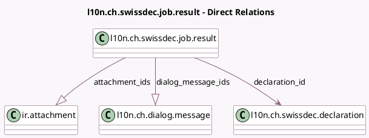

<!-- GENERATED:MODEL -->
---
tags: [odoo, enterprise, generated, model]
---

# l10n.ch.swissdec.job.result

- Module: [[docs/Enterprise Addons/l10n_ch_hr_payroll/l10n_ch_hr_payroll|l10n_ch_hr_payroll]]
- Scope: Enterprise Addons
- Defined in module: yes
- Source files: `models/l10n_ch_swissdec_declaration_result.py`
- Python classes: `L10nCHSwissdecJobResult`
- Description: Swissdec Job
- Inherits: `mail.thread`

## Field footprint

- Detected fields: 23
- Field types: `Boolean` x 4, `Char` x 6, `Datetime` x 1, `Integer` x 1, `Json` x 4, `Many2one` x 1, `One2many` x 2, `Selection` x 4
- Relation fields: 3

## Sample fields

- `attachment_ids`: `One2many` (comodel `ir.attachment`)
- `completion_url`: `Char`
- `credential_key`: `Char`
- `credential_password`: `Char`
- `declaration_id`: `Many2one` (comodel `l10n.ch.swissdec.declaration`)
- `dialog_message_ids`: `One2many` (comodel `l10n.ch.dialog.message`)
- `dialog_response_json`: `Json`
- `domain`: `Selection`
- `general_state`: `Selection`
- `has_lpp_contributions`: `Boolean` (compute `_compute_has_lpp_contributions`)
- `has_proof_of_insurance`: `Boolean` (compute `_compute_has_proof_of_insurance`)
- `has_st_corrections`: `Boolean` (compute `_compute_has_st_corrections`)
- `institution_id_ref`: `Char`
- `last_raw_response`: `Char`
- `proof_of_insurance_count`: `Integer` (compute `_compute_proof_of_insurance_count`)
- `result_meta_data`: `Json`
- `result_response_json`: `Json`
- `result_state`: `Selection`
- `status_response_json`: `Json`
- `success_state`: `Selection`

## Method hints

- Detected methods: 20
- Action methods: `action_get_dialog`, `action_get_dialog_and_open_result`, `action_get_result_from_declare_salary`, `action_open_completion_url`, `action_open_dialog_message_ids`, `action_open_proof_of_insurance`, `action_open_status_notification`, `action_open_swissdec_job_result`
- Compute methods: `_compute_display_name`, `_compute_has_lpp_contributions`, `_compute_has_proof_of_insurance`, `_compute_has_st_corrections`, `_compute_proof_of_insurance_count`
- Onchange methods: none

## Direct relation diagram

## Navigation

- **Parent:** [[docs/Enterprise Addons/l10n_ch_hr_payroll/Models]]

<!-- GENERATED:MODEL -->
