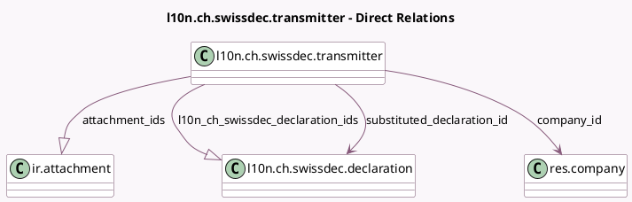

<!-- GENERATED:MODEL -->
---
tags: [odoo, enterprise, generated, model]
---

# l10n.ch.swissdec.transmitter

- Module: [[docs/Enterprise Addons/l10n_ch_hr_payroll/l10n_ch_hr_payroll|l10n_ch_hr_payroll]]
- Scope: Enterprise Addons
- Defined in module: yes
- Source files: `models/l10n_ch_transmission_mixin.py`
- Python classes: `L10nCHSwissdecTransmitter`
- Description: Abstract Swissdec Transmitter
- Inherits: `mail.thread`

## Field footprint

- Detected fields: 13
- Field types: `Boolean` x 3, `Char` x 1, `Integer` x 2, `Json` x 2, `Many2one` x 2, `One2many` x 2, `Selection` x 1
- Relation fields: 4

## Sample fields

- `actionable_warnings`: `Json` (compute `_compute_actionable_warnings`, store `True`)
- `active`: `Boolean`
- `attachment_ids`: `One2many` (comodel `ir.attachment`)
- `company_id`: `Many2one` (comodel `res.company`)
- `l10n_ch_declare_salary_data`: `Json`
- `l10n_ch_swissdec_declaration_ids`: `One2many` (comodel `l10n.ch.swissdec.declaration`)
- `l10n_ch_swissdec_declaration_ids_size`: `Integer` (compute `_compute_l10n_ch_swissdec_declaration_ids_size`)
- `month`: `Selection`
- `name`: `Char`
- `replacement_declaration`: `Boolean`
- `substituted_declaration_id`: `Many2one` (comodel `l10n.ch.swissdec.declaration`)
- `test_transmission`: `Boolean`
- `year`: `Integer`

## Method hints

- Detected methods: 10
- Action methods: `action_declare_salary`, `action_open_swissec_declarations`, `action_prepare_data`
- Compute methods: `_compute_actionable_warnings`, `_compute_l10n_ch_swissdec_declaration_ids_size`
- Onchange methods: none

## Direct relation diagram

## Navigation

- **Parent:** [[docs/Enterprise Addons/l10n_ch_hr_payroll/Models]]

<!-- GENERATED:MODEL -->
