<!-- GENERATED:MODEL -->
---
tags: [odoo, enterprise, generated, model]
---

# l10n.ch.tax.rate.import.wizard

- Module: [[docs/Enterprise Addons/l10n_ch_hr_payroll/l10n_ch_hr_payroll|l10n_ch_hr_payroll]]
- Scope: Enterprise Addons
- Defined in module: yes
- Source files: `wizard/l10n_ch_tax_rate_import.py`
- Python classes: `L10nChTaxRateImportWizard`
- Description: Swiss Payroll: Tax rate import wizard

## Field footprint

- Detected fields: 5
- Field types: `Integer` x 1, `One2many` x 1, `Selection` x 3
- Relation fields: 1

## Sample fields

- `canton`: `Selection`
- `canton_mode`: `Selection`
- `import_mode`: `Selection`
- `tax_file_ids`: `One2many` (comodel `ir.attachment`)
- `year`: `Integer`

## Method hints

- Detected methods: 4
- Action methods: `action_import_file`, `action_import_from_website`
- Compute methods: none
- Onchange methods: none

## Direct relation diagram

```plantuml
@startuml
!define ODOO_COLOR_PRIMARY #714B67
!define ODOO_COLOR_ACCENT #875A7B
!define ODOO_COLOR_BG #FAF7FA

skinparam backgroundColor ODOO_COLOR_BG
skinparam defaultTextAlignment left
skinparam ArrowColor ODOO_COLOR_ACCENT
skinparam ClassBackgroundColor white
skinparam ClassBorderColor ODOO_COLOR_PRIMARY
skinparam ComponentBackgroundColor white
skinparam ComponentBorderColor ODOO_COLOR_PRIMARY
skinparam NoteBackgroundColor #FFF8FF
skinparam NoteBorderColor ODOO_COLOR_ACCENT
skinparam SequenceLifeLineBorderColor ODOO_COLOR_ACCENT
skinparam SequenceLifeLineBackgroundColor #FFFFFF
skinparam SequenceParticipantBorderColor ODOO_COLOR_PRIMARY
skinparam SequenceParticipantBackgroundColor #FFFFFF
skinparam sequence {
  ArrowColor ODOO_COLOR_ACCENT
  ActorBorderColor ODOO_COLOR_PRIMARY
}
title l10n.ch.tax.rate.import.wizard - Direct Relations
class "l10n.ch.tax.rate.import.wizard" as l10n_ch_tax_rate_import_wizard
class "ir.attachment" as ir_attachment
l10n_ch_tax_rate_import_wizard --|> ir_attachment : tax_file_ids
@enduml
```

## Navigation

- **Parent:** [[docs/Enterprise Addons/l10n_ch_hr_payroll/Models]]

<!-- GENERATED:MODEL -->
