<!-- GENERATED:MODEL -->
---
tags: [odoo, enterprise, generated, model]
---

# res.company

- Module: [[docs/Enterprise Addons/l10n_ch_hr_payroll/l10n_ch_hr_payroll|l10n_ch_hr_payroll]]
- Scope: Enterprise Addons
- Defined in module: extension only
- Source files: `models/res_company.py`
- Python classes: `ResCompany`

## Field footprint

- Detected fields: 30
- Field types: `Boolean` x 3, `Char` x 14, `Many2one` x 2, `One2many` x 9, `Selection` x 2
- Relation fields: 11

## Sample fields

- `l10n_ch_30_day_method`: `Boolean`
- `l10n_ch_additional_line`: `Char` (comodel `Additional Line`)
- `l10n_ch_agricole_company`: `Boolean`
- `l10n_ch_avs_institution_ids`: `One2many` (comodel `l10n.ch.social.insurance`)
- `l10n_ch_caf_institution_ids`: `One2many` (comodel `l10n.ch.compensation.fund`)
- `l10n_ch_contact_person_email`: `Char`
- `l10n_ch_contact_person_name`: `Char`
- `l10n_ch_contact_person_phone`: `Char`
- `l10n_ch_delegate_Po_Box`: `Char`
- `l10n_ch_delegate_city`: `Char`
- `l10n_ch_delegate_country_id`: `Many2one` (comodel `res.country`)
- `l10n_ch_delegate_state_id`: `Many2one` (comodel `res.country.state`)
- `l10n_ch_delegate_street`: `Char`
- `l10n_ch_delegate_street2`: `Char`
- `l10n_ch_delegate_zip`: `Char`
- `l10n_ch_ijm_institution_ids`: `One2many` (comodel `l10n.ch.sickness.insurance`)
- `l10n_ch_laa_institution_ids`: `One2many` (comodel `l10n.ch.accident.insurance`)
- `l10n_ch_laac_institution_ids`: `One2many` (comodel `l10n.ch.additional.accident.insurance`)
- `l10n_ch_lpp_institution_ids`: `One2many` (comodel `l10n.ch.lpp.insurance`)
- `l10n_ch_post_box`: `Char`

## Method hints

- Detected methods: 6
- Action methods: none
- Compute methods: none
- Onchange methods: none

## Direct relation diagram

```plantuml
@startuml
!define ODOO_COLOR_PRIMARY #714B67
!define ODOO_COLOR_ACCENT #875A7B
!define ODOO_COLOR_BG #FAF7FA

skinparam backgroundColor ODOO_COLOR_BG
skinparam defaultTextAlignment left
skinparam ArrowColor ODOO_COLOR_ACCENT
skinparam ClassBackgroundColor white
skinparam ClassBorderColor ODOO_COLOR_PRIMARY
skinparam ComponentBackgroundColor white
skinparam ComponentBorderColor ODOO_COLOR_PRIMARY
skinparam NoteBackgroundColor #FFF8FF
skinparam NoteBorderColor ODOO_COLOR_ACCENT
skinparam SequenceLifeLineBorderColor ODOO_COLOR_ACCENT
skinparam SequenceLifeLineBackgroundColor #FFFFFF
skinparam SequenceParticipantBorderColor ODOO_COLOR_PRIMARY
skinparam SequenceParticipantBackgroundColor #FFFFFF
skinparam sequence {
  ArrowColor ODOO_COLOR_ACCENT
  ActorBorderColor ODOO_COLOR_PRIMARY
}
title res.company - Direct Relations
class "res.company" as res_company
class "l10n.ch.accident.insurance" as l10n_ch_accident_insurance
class "l10n.ch.additional.accident.insurance" as l10n_ch_additional_accident_insurance
class "l10n.ch.compensation.fund" as l10n_ch_compensation_fund
class "l10n.ch.location.unit" as l10n_ch_location_unit
class "l10n.ch.lpp.insurance" as l10n_ch_lpp_insurance
class "l10n.ch.salary.certificate.profile" as l10n_ch_salary_certificate_profile
class "l10n.ch.sickness.insurance" as l10n_ch_sickness_insurance
class "l10n.ch.social.insurance" as l10n_ch_social_insurance
class "l10n.ch.source.tax.institution" as l10n_ch_source_tax_institution
class "res.country" as res_country
class "res.country.state" as res_country_state
res_company --|> l10n_ch_social_insurance : l10n_ch_avs_institution_ids
res_company --|> l10n_ch_compensation_fund : l10n_ch_caf_institution_ids
res_company --|> l10n_ch_accident_insurance : l10n_ch_laa_institution_ids
res_company --|> l10n_ch_additional_accident_insurance : l10n_ch_laac_institution_ids
res_company --|> l10n_ch_sickness_insurance : l10n_ch_ijm_institution_ids
res_company --|> l10n_ch_lpp_insurance : l10n_ch_lpp_institution_ids
res_company --|> l10n_ch_location_unit : l10n_ch_work_location_ids
res_company --|> l10n_ch_source_tax_institution : l10n_ch_st_institution_ids
res_company --|> l10n_ch_salary_certificate_profile : l10n_ch_salary_certificate_profiles
res_company --> res_country_state : l10n_ch_delegate_state_id
res_company --> res_country : l10n_ch_delegate_country_id
@enduml
```

## Navigation

- **Parent:** [[docs/Enterprise Addons/l10n_ch_hr_payroll/Models]]

<!-- GENERATED:MODEL -->
