<!-- GENERATED:MODEL -->
---
tags: [odoo, enterprise, generated, model]
---

# res.config.settings

- Module: [[docs/Enterprise Addons/l10n_ch_hr_payroll/l10n_ch_hr_payroll|l10n_ch_hr_payroll]]
- Scope: Enterprise Addons
- Defined in module: extension only
- Source files: `models/res_config_settings.py`
- Python classes: `ResConfigSettings`

## Field footprint

- Detected fields: 20
- Field types: `Boolean` x 3, `Char` x 13, `Many2one` x 2, `Selection` x 2
- Relation fields: 2

## Sample fields

- `l10n_ch_30_day_method`: `Boolean` (related `company_id.l10n_ch_30_day_method`)
- `l10n_ch_agricole_company`: `Boolean` (related `company_id.l10n_ch_agricole_company`)
- `l10n_ch_contact_person_email`: `Char` (related `company_id.l10n_ch_contact_person_email`)
- `l10n_ch_contact_person_name`: `Char` (related `company_id.l10n_ch_contact_person_name`)
- `l10n_ch_contact_person_phone`: `Char` (related `company_id.l10n_ch_contact_person_phone`)
- `l10n_ch_delegate_Po_Box`: `Char` (related `company_id.l10n_ch_delegate_Po_Box`)
- `l10n_ch_delegate_city`: `Char` (related `company_id.l10n_ch_delegate_city`)
- `l10n_ch_delegate_country_id`: `Many2one` (comodel `res.country`, related `company_id.l10n_ch_delegate_country_id`)
- `l10n_ch_delegate_state_id`: `Many2one` (comodel `res.country.state`, related `company_id.l10n_ch_delegate_state_id`)
- `l10n_ch_delegate_street`: `Char` (related `company_id.l10n_ch_delegate_street`)
- `l10n_ch_delegate_street2`: `Char` (related `company_id.l10n_ch_delegate_street2`)
- `l10n_ch_delegate_zip`: `Char` (related `company_id.l10n_ch_delegate_zip`)
- `l10n_ch_post_box`: `Char` (related `company_id.l10n_ch_post_box`)
- `l10n_ch_statistics_convention`: `Selection` (related `company_id.l10n_ch_statistics_convention`)
- `l10n_ch_statistics_payroll_unit`: `Char` (related `company_id.l10n_ch_statistics_payroll_unit`)
- `l10n_ch_swissdec_delegate_ch_uid`: `Char` (related `company_id.l10n_ch_swissdec_delegate_ch_uid`)
- `l10n_ch_swissdec_delegate_name`: `Char` (related `company_id.l10n_ch_swissdec_delegate_name`)
- `l10n_ch_transmission_language`: `Selection` (related `company_id.l10n_ch_transmission_language`)
- `l10n_ch_uid`: `Char` (related `company_id.l10n_ch_uid`)
- `l10n_ch_uses_delegate`: `Boolean` (related `company_id.l10n_ch_uses_delegate`)

## Method hints

- Detected methods: 0
- Action methods: none
- Compute methods: none
- Onchange methods: none

## Direct relation diagram

```plantuml
@startuml
!define ODOO_COLOR_PRIMARY #714B67
!define ODOO_COLOR_ACCENT #875A7B
!define ODOO_COLOR_BG #FAF7FA

skinparam backgroundColor ODOO_COLOR_BG
skinparam defaultTextAlignment left
skinparam ArrowColor ODOO_COLOR_ACCENT
skinparam ClassBackgroundColor white
skinparam ClassBorderColor ODOO_COLOR_PRIMARY
skinparam ComponentBackgroundColor white
skinparam ComponentBorderColor ODOO_COLOR_PRIMARY
skinparam NoteBackgroundColor #FFF8FF
skinparam NoteBorderColor ODOO_COLOR_ACCENT
skinparam SequenceLifeLineBorderColor ODOO_COLOR_ACCENT
skinparam SequenceLifeLineBackgroundColor #FFFFFF
skinparam SequenceParticipantBorderColor ODOO_COLOR_PRIMARY
skinparam SequenceParticipantBackgroundColor #FFFFFF
skinparam sequence {
  ArrowColor ODOO_COLOR_ACCENT
  ActorBorderColor ODOO_COLOR_PRIMARY
}
title res.config.settings - Direct Relations
class "res.config.settings" as res_config_settings
class "res.country" as res_country
class "res.country.state" as res_country_state
res_config_settings --> res_country_state : l10n_ch_delegate_state_id
res_config_settings --> res_country : l10n_ch_delegate_country_id
@enduml
```

## Navigation

- **Parent:** [[docs/Enterprise Addons/l10n_ch_hr_payroll/Models]]

<!-- GENERATED:MODEL -->
