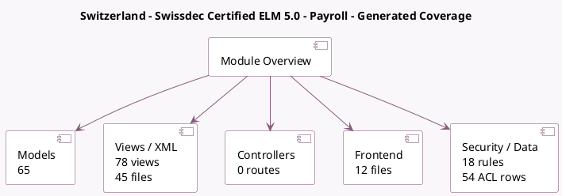

<!-- GENERATED:MODULE -->
---
tags: [odoo, enterprise, module]
---

# Switzerland - Swissdec Certified ELM 5.0 - Payroll

- Scope: Enterprise Addons
- Source: enterprise/l10n_ch_hr_payroll
- Dependencies: [[docs/Enterprise Addons/hr_payroll/hr_payroll|hr_payroll]], [[docs/Community Addons/hr_work_entry_holidays/hr_work_entry_holidays|hr_work_entry_holidays]], [[docs/Enterprise Addons/hr_payroll_holidays/hr_payroll_holidays|hr_payroll_holidays]], [[docs/Community Addons/iap/iap|iap]]

## Generated coverage

- Models: 65
- XML files with UI/data artifacts: 45
- Views: 78
- Actions: 33
- Menus: 34
- Rules (ir.rule): 18
- Access CSV entries: 54
- Controller units: 0
- Frontend asset files: 12

## Module map

## Detail notes

- Models: [[docs/Enterprise Addons/l10n_ch_hr_payroll/Models|Models]] (65)
- Views and XML: [[docs/Enterprise Addons/l10n_ch_hr_payroll/Views|Views]] (45 files)
- Frontend: [[docs/Enterprise Addons/l10n_ch_hr_payroll/Frontend|Frontend]] (12 files)

## Key models

- `ch.yearly.report`
- `hr.employee`
- `hr.employee.is.line`
- `hr.employee.is.line.correction`
- `hr.leave`
- `hr.leave.type`
- `hr.payslip`
- `hr.payslip.is.log.line`
- `hr.payslip.run`
- `hr.rule.parameter`
- `hr.salary.rule`
- `hr.version`

## Navigation

- [[../Enterprise Addons/Enterprise Addons|Back to scope]]
- [[../../docs/docs|Back to docs]]

<!-- GENERATED:MODULE -->

