<!-- GENERATED:MODEL -->
---
tags: [odoo, enterprise, generated, model]
---

# l10n.ch.caf.scale

- Module: [[docs/Enterprise Addons/l10n_ch_hr_payroll_elm_transmission_5_3/l10n_ch_hr_payroll_elm_transmission_5_3|l10n_ch_hr_payroll_elm_transmission_5_3]]
- Scope: Enterprise Addons
- Defined in module: yes
- Source files: `models/l10n_caf.py`, `models/l10n_ch_caf_scale.py`
- Python classes: `L10nChCafScale`
- Description: Swiss Family Allowance Scale

## Field footprint

- Detected fields: 7
- Field types: `Float` x 2, `Integer` x 3, `Many2one` x 1, `Selection` x 1
- Relation fields: 1

## Sample fields

- `allowance_type`: `Selection`
- `amount`: `Float`
- `amount_supplementary`: `Float`
- `fund_id`: `Many2one` (comodel `l10n.ch.compensation.fund`)
- `max_age`: `Integer`
- `min_age`: `Integer`
- `min_child_rank`: `Integer`

## Method hints

- Detected methods: 0
- Action methods: none
- Compute methods: none
- Onchange methods: none

## Direct relation diagram

```plantuml
@startuml
!define ODOO_COLOR_PRIMARY #714B67
!define ODOO_COLOR_ACCENT #875A7B
!define ODOO_COLOR_BG #FAF7FA

skinparam backgroundColor ODOO_COLOR_BG
skinparam defaultTextAlignment left
skinparam ArrowColor ODOO_COLOR_ACCENT
skinparam ClassBackgroundColor white
skinparam ClassBorderColor ODOO_COLOR_PRIMARY
skinparam ComponentBackgroundColor white
skinparam ComponentBorderColor ODOO_COLOR_PRIMARY
skinparam NoteBackgroundColor #FFF8FF
skinparam NoteBorderColor ODOO_COLOR_ACCENT
skinparam SequenceLifeLineBorderColor ODOO_COLOR_ACCENT
skinparam SequenceLifeLineBackgroundColor #FFFFFF
skinparam SequenceParticipantBorderColor ODOO_COLOR_PRIMARY
skinparam SequenceParticipantBackgroundColor #FFFFFF
skinparam sequence {
  ArrowColor ODOO_COLOR_ACCENT
  ActorBorderColor ODOO_COLOR_PRIMARY
}
title l10n.ch.caf.scale - Direct Relations
class "l10n.ch.caf.scale" as l10n_ch_caf_scale
class "l10n.ch.compensation.fund" as l10n_ch_compensation_fund
l10n_ch_caf_scale --> l10n_ch_compensation_fund : fund_id
@enduml
```

## Navigation

- **Parent:** [[docs/Enterprise Addons/l10n_ch_hr_payroll_elm_transmission_5_3/Models]]

<!-- GENERATED:MODEL -->
