<!-- GENERATED:MODEL -->
---
tags: [odoo, enterprise, generated, model]
---

# l10n.ch.compensation.fund

- Module: [[docs/Enterprise Addons/l10n_ch_hr_payroll_elm_transmission_5_3/l10n_ch_hr_payroll_elm_transmission_5_3|l10n_ch_hr_payroll_elm_transmission_5_3]]
- Scope: Enterprise Addons
- Defined in module: extension only
- Source files: `models/l10n_caf.py`
- Python classes: `L10nChCompensationFund`

## Field footprint

- Detected fields: 2
- Field types: `Boolean` x 1, `One2many` x 1
- Relation fields: 1

## Sample fields

- `caf_scale_ids`: `One2many` (comodel `l10n.ch.caf.scale`)
- `paid_by_fcf`: `Boolean` (comodel `Child allowances paid by FCF`)

## Method hints

- Detected methods: 1
- Action methods: none
- Compute methods: none
- Onchange methods: none

## Direct relation diagram

```plantuml
@startuml
!define ODOO_COLOR_PRIMARY #714B67
!define ODOO_COLOR_ACCENT #875A7B
!define ODOO_COLOR_BG #FAF7FA

skinparam backgroundColor ODOO_COLOR_BG
skinparam defaultTextAlignment left
skinparam ArrowColor ODOO_COLOR_ACCENT
skinparam ClassBackgroundColor white
skinparam ClassBorderColor ODOO_COLOR_PRIMARY
skinparam ComponentBackgroundColor white
skinparam ComponentBorderColor ODOO_COLOR_PRIMARY
skinparam NoteBackgroundColor #FFF8FF
skinparam NoteBorderColor ODOO_COLOR_ACCENT
skinparam SequenceLifeLineBorderColor ODOO_COLOR_ACCENT
skinparam SequenceLifeLineBackgroundColor #FFFFFF
skinparam SequenceParticipantBorderColor ODOO_COLOR_PRIMARY
skinparam SequenceParticipantBackgroundColor #FFFFFF
skinparam sequence {
  ArrowColor ODOO_COLOR_ACCENT
  ActorBorderColor ODOO_COLOR_PRIMARY
}
title l10n.ch.compensation.fund - Direct Relations
class "l10n.ch.compensation.fund" as l10n_ch_compensation_fund
class "l10n.ch.caf.scale" as l10n_ch_caf_scale
l10n_ch_compensation_fund --|> l10n_ch_caf_scale : caf_scale_ids
@enduml
```

## Navigation

- **Parent:** [[docs/Enterprise Addons/l10n_ch_hr_payroll_elm_transmission_5_3/Models]]

<!-- GENERATED:MODEL -->
