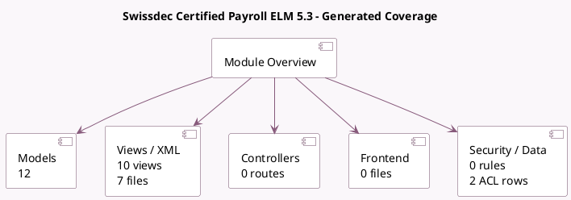

<!-- GENERATED:MODULE -->
---
tags: [odoo, enterprise, module]
---

# Swissdec Certified Payroll ELM 5.3

- Scope: Enterprise Addons
- Source: enterprise/l10n_ch_hr_payroll_elm_transmission_5_3
- Dependencies: [[docs/Enterprise Addons/l10n_ch_hr_payroll/l10n_ch_hr_payroll|l10n_ch_hr_payroll]]

## Generated coverage

- Models: 12
- XML files with UI/data artifacts: 7
- Views: 10
- Actions: 1
- Menus: 1
- Rules (ir.rule): 0
- Access CSV entries: 2
- Controller units: 0
- Frontend asset files: 0

## Module map

## Detail notes

- Models: [[docs/Enterprise Addons/l10n_ch_hr_payroll_elm_transmission_5_3/Models|Models]] (12)
- Views and XML: [[docs/Enterprise Addons/l10n_ch_hr_payroll_elm_transmission_5_3/Views|Views]] (7 files)

## Key models

- `hr.employee`
- `hr.payslip`
- `hr.version`
- `l10n.ch.additional.accident.insurance.line`
- `l10n.ch.additional.accident.insurance.line.rate`
- `l10n.ch.caf.scale`
- `l10n.ch.compensation.fund`
- `l10n.ch.hr.employee.children`
- `l10n.ch.lpp.insurance`
- `l10n.ch.sickness.insurance.line`
- `l10n.ch.sickness.insurance.line.rate`
- `l10n.lpp.coordination.amount`

## Navigation

- [[../Enterprise Addons/Enterprise Addons|Back to scope]]
- [[../../docs/docs|Back to docs]]

<!-- GENERATED:MODULE -->

