<!-- GENERATED:MODEL -->
---
tags: [odoo, enterprise, generated, model]
---

# account.move

- Module: [[docs/Enterprise Addons/l10n_cl_edi/l10n_cl_edi|l10n_cl_edi]]
- Scope: Enterprise Addons
- Defined in module: yes
- Source files: `models/account_move.py`
- Python classes: `AccountMove`
- Inherits: `l10n_cl.edi.util`

## Field footprint

- Detected fields: 11
- Field types: `Char` x 2, `Many2one` x 2, `One2many` x 1, `Selection` x 5, `Text` x 1
- Relation fields: 3

## Sample fields

- `l10n_cl_claim`: `Selection`
- `l10n_cl_claim_description`: `Char`
- `l10n_cl_dte_acceptation_status`: `Selection`
- `l10n_cl_dte_file`: `Many2one` (comodel `ir.attachment`)
- `l10n_cl_dte_partner_status`: `Selection`
- `l10n_cl_dte_status`: `Selection`
- `l10n_cl_journal_point_of_sale_type`: `Selection` (related `journal_id.l10n_cl_point_of_sale_type`)
- `l10n_cl_reference_ids`: `One2many` (comodel `l10n_cl.edi.reference`)
- `l10n_cl_sii_barcode`: `Char`
- `l10n_cl_sii_send_file`: `Many2one` (comodel `ir.attachment`)
- `l10n_cl_sii_send_ident`: `Text`

## Method hints

- Detected methods: 58
- Action methods: `action_reverse`
- Compute methods: `_compute_l10n_latam_document_type`
- Onchange methods: none

## Direct relation diagram

```plantuml
@startuml
!define ODOO_COLOR_PRIMARY #714B67
!define ODOO_COLOR_ACCENT #875A7B
!define ODOO_COLOR_BG #FAF7FA

skinparam backgroundColor ODOO_COLOR_BG
skinparam defaultTextAlignment left
skinparam ArrowColor ODOO_COLOR_ACCENT
skinparam ClassBackgroundColor white
skinparam ClassBorderColor ODOO_COLOR_PRIMARY
skinparam ComponentBackgroundColor white
skinparam ComponentBorderColor ODOO_COLOR_PRIMARY
skinparam NoteBackgroundColor #FFF8FF
skinparam NoteBorderColor ODOO_COLOR_ACCENT
skinparam SequenceLifeLineBorderColor ODOO_COLOR_ACCENT
skinparam SequenceLifeLineBackgroundColor #FFFFFF
skinparam SequenceParticipantBorderColor ODOO_COLOR_PRIMARY
skinparam SequenceParticipantBackgroundColor #FFFFFF
skinparam sequence {
  ArrowColor ODOO_COLOR_ACCENT
  ActorBorderColor ODOO_COLOR_PRIMARY
}
title account.move - Direct Relations
class "account.move" as account_move
class "ir.attachment" as ir_attachment
class "l10n_cl.edi.reference" as l10n_cl_edi_reference
account_move --> ir_attachment : l10n_cl_sii_send_file
account_move --> ir_attachment : l10n_cl_dte_file
account_move --|> l10n_cl_edi_reference : l10n_cl_reference_ids
@enduml
```

## Navigation

- **Parent:** [[docs/Enterprise Addons/l10n_cl_edi/Models]]

<!-- GENERATED:MODEL -->
