<!-- GENERATED:MODEL -->
---
tags: [odoo, enterprise, generated, model]
---

# certificate.certificate

- Module: [[docs/Enterprise Addons/l10n_cl_edi/l10n_cl_edi|l10n_cl_edi]]
- Scope: Enterprise Addons
- Defined in module: extension only
- Source files: `models/certificate.py`
- Python classes: `CertificateCertificate`

## Field footprint

- Detected fields: 6
- Field types: `Boolean` x 1, `Char` x 3, `Datetime` x 1, `Many2one` x 1
- Relation fields: 1

## Sample fields

- `l10n_cl_is_there_shared_certificate`: `Boolean` (related `company_id.l10n_cl_is_there_shared_certificate`)
- `last_rest_token`: `Char` (comodel `Last REST Token`)
- `last_token`: `Char` (comodel `Last Token`)
- `subject_serial_number`: `Char` (compute `_compute_subject_serial_number`, store `True`)
- `token_time`: `Datetime` (comodel `Token Time`)
- `user_id`: `Many2one` (comodel `res.users`)

## Method hints

- Detected methods: 1
- Action methods: none
- Compute methods: `_compute_subject_serial_number`
- Onchange methods: none

## Direct relation diagram

```plantuml
@startuml
!define ODOO_COLOR_PRIMARY #714B67
!define ODOO_COLOR_ACCENT #875A7B
!define ODOO_COLOR_BG #FAF7FA

skinparam backgroundColor ODOO_COLOR_BG
skinparam defaultTextAlignment left
skinparam ArrowColor ODOO_COLOR_ACCENT
skinparam ClassBackgroundColor white
skinparam ClassBorderColor ODOO_COLOR_PRIMARY
skinparam ComponentBackgroundColor white
skinparam ComponentBorderColor ODOO_COLOR_PRIMARY
skinparam NoteBackgroundColor #FFF8FF
skinparam NoteBorderColor ODOO_COLOR_ACCENT
skinparam SequenceLifeLineBorderColor ODOO_COLOR_ACCENT
skinparam SequenceLifeLineBackgroundColor #FFFFFF
skinparam SequenceParticipantBorderColor ODOO_COLOR_PRIMARY
skinparam SequenceParticipantBackgroundColor #FFFFFF
skinparam sequence {
  ArrowColor ODOO_COLOR_ACCENT
  ActorBorderColor ODOO_COLOR_PRIMARY
}
title certificate.certificate - Direct Relations
class "certificate.certificate" as certificate_certificate
class "res.users" as res_users
certificate_certificate --> res_users : user_id
@enduml
```

## Navigation

- **Parent:** [[docs/Enterprise Addons/l10n_cl_edi/Models]]

<!-- GENERATED:MODEL -->
