<!-- GENERATED:MODEL -->
---
tags: [odoo, enterprise, generated, model]
---

# l10n_cl.dte.caf

- Module: [[docs/Enterprise Addons/l10n_cl_edi/l10n_cl_edi|l10n_cl_edi]]
- Scope: Enterprise Addons
- Defined in module: yes
- Source files: `models/l10n_cl_dte_caf.py`
- Python classes: `L10n_ClDteCaf`
- Description: CAF Files for chilean electronic invoicing
- Inherits: `l10n_cl.edi.util`

## Field footprint

- Detected fields: 8
- Field types: `Binary` x 1, `Char` x 1, `Date` x 1, `Integer` x 2, `Many2one` x 2, `Selection` x 1
- Relation fields: 2

## Sample fields

- `caf_file`: `Binary`
- `company_id`: `Many2one` (comodel `res.company`)
- `filename`: `Char` (comodel `File Name`)
- `final_nb`: `Integer`
- `issued_date`: `Date` (comodel `Issued Date`)
- `l10n_latam_document_type_id`: `Many2one` (comodel `l10n_latam.document.type`)
- `start_nb`: `Integer`
- `status`: `Selection`

## Method hints

- Detected methods: 4
- Action methods: `action_enable`, `action_spend`
- Compute methods: none
- Onchange methods: none

## Direct relation diagram

```plantuml
@startuml
!define ODOO_COLOR_PRIMARY #714B67
!define ODOO_COLOR_ACCENT #875A7B
!define ODOO_COLOR_BG #FAF7FA

skinparam backgroundColor ODOO_COLOR_BG
skinparam defaultTextAlignment left
skinparam ArrowColor ODOO_COLOR_ACCENT
skinparam ClassBackgroundColor white
skinparam ClassBorderColor ODOO_COLOR_PRIMARY
skinparam ComponentBackgroundColor white
skinparam ComponentBorderColor ODOO_COLOR_PRIMARY
skinparam NoteBackgroundColor #FFF8FF
skinparam NoteBorderColor ODOO_COLOR_ACCENT
skinparam SequenceLifeLineBorderColor ODOO_COLOR_ACCENT
skinparam SequenceLifeLineBackgroundColor #FFFFFF
skinparam SequenceParticipantBorderColor ODOO_COLOR_PRIMARY
skinparam SequenceParticipantBackgroundColor #FFFFFF
skinparam sequence {
  ArrowColor ODOO_COLOR_ACCENT
  ActorBorderColor ODOO_COLOR_PRIMARY
}
title l10n_cl.dte.caf - Direct Relations
class "l10n_cl.dte.caf" as l10n_cl_dte_caf
class "l10n_latam.document.type" as l10n_latam_document_type
class "res.company" as res_company
l10n_cl_dte_caf --> l10n_latam_document_type : l10n_latam_document_type_id
l10n_cl_dte_caf --> res_company : company_id
@enduml
```

## Navigation

- **Parent:** [[docs/Enterprise Addons/l10n_cl_edi/Models]]

<!-- GENERATED:MODEL -->
