<!-- GENERATED:MODEL -->
---
tags: [odoo, enterprise, generated, model]
---

# l10n_cl.edi.reference

- Module: [[docs/Enterprise Addons/l10n_cl_edi/l10n_cl_edi|l10n_cl_edi]]
- Scope: Enterprise Addons
- Defined in module: yes
- Source files: `models/l10n_cl_edi_reference.py`
- Python classes: `L10n_ClEdiReference`
- Description: Cross Reference Docs for Chilean Electronic Invoicing

## Field footprint

- Detected fields: 7
- Field types: `Char` x 2, `Date` x 1, `Many2one` x 2, `Selection` x 2
- Relation fields: 2

## Sample fields

- `date`: `Date`
- `l10n_cl_reference_doc_internal_type`: `Selection` (related `l10n_cl_reference_doc_type_id.internal_type`)
- `l10n_cl_reference_doc_type_id`: `Many2one` (comodel `l10n_latam.document.type`)
- `move_id`: `Many2one` (comodel `account.move`)
- `origin_doc_number`: `Char`
- `reason`: `Char`
- `reference_doc_code`: `Selection`

## Method hints

- Detected methods: 0
- Action methods: none
- Compute methods: none
- Onchange methods: none

## Direct relation diagram

```plantuml
@startuml
!define ODOO_COLOR_PRIMARY #714B67
!define ODOO_COLOR_ACCENT #875A7B
!define ODOO_COLOR_BG #FAF7FA

skinparam backgroundColor ODOO_COLOR_BG
skinparam defaultTextAlignment left
skinparam ArrowColor ODOO_COLOR_ACCENT
skinparam ClassBackgroundColor white
skinparam ClassBorderColor ODOO_COLOR_PRIMARY
skinparam ComponentBackgroundColor white
skinparam ComponentBorderColor ODOO_COLOR_PRIMARY
skinparam NoteBackgroundColor #FFF8FF
skinparam NoteBorderColor ODOO_COLOR_ACCENT
skinparam SequenceLifeLineBorderColor ODOO_COLOR_ACCENT
skinparam SequenceLifeLineBackgroundColor #FFFFFF
skinparam SequenceParticipantBorderColor ODOO_COLOR_PRIMARY
skinparam SequenceParticipantBackgroundColor #FFFFFF
skinparam sequence {
  ArrowColor ODOO_COLOR_ACCENT
  ActorBorderColor ODOO_COLOR_PRIMARY
}
title l10n_cl.edi.reference - Direct Relations
class "l10n_cl.edi.reference" as l10n_cl_edi_reference
class "account.move" as account_move
class "l10n_latam.document.type" as l10n_latam_document_type
l10n_cl_edi_reference --> l10n_latam_document_type : l10n_cl_reference_doc_type_id
l10n_cl_edi_reference --> account_move : move_id
@enduml
```

## Navigation

- **Parent:** [[docs/Enterprise Addons/l10n_cl_edi/Models]]

<!-- GENERATED:MODEL -->
