<!-- GENERATED:MODEL -->
---
tags: [odoo, enterprise, generated, model]
---

# res.company

- Module: [[docs/Enterprise Addons/l10n_cl_edi/l10n_cl_edi|l10n_cl_edi]]
- Scope: Enterprise Addons
- Defined in module: extension only
- Source files: `models/res_company.py`
- Python classes: `ResCompany`

## Field footprint

- Detected fields: 9
- Field types: `Boolean` x 1, `Char` x 2, `Date` x 1, `Many2many` x 1, `One2many` x 1, `Selection` x 3
- Relation fields: 2

## Sample fields

- `l10n_cl_certificate_ids`: `One2many` (comodel `certificate.certificate`)
- `l10n_cl_company_activity_ids`: `Many2many` (comodel `l10n_cl.company.activities`)
- `l10n_cl_dte_email`: `Char` (comodel `DTE Email`, related `partner_id.l10n_cl_dte_email`)
- `l10n_cl_dte_resolution_date`: `Date` (comodel `SII Exempt Resolution Date`)
- `l10n_cl_dte_resolution_number`: `Char` (comodel `SII Exempt Resolution Number`)
- `l10n_cl_dte_service_provider`: `Selection`
- `l10n_cl_is_there_shared_certificate`: `Boolean` (comodel `Is There Shared Certificate?`, compute `_compute_is_there_shared_cert`)
- `l10n_cl_sii_regional_office`: `Selection`
- `l10n_cl_sii_taxpayer_type`: `Selection` (related `partner_id.l10n_cl_sii_taxpayer_type`)

## Method hints

- Detected methods: 4
- Action methods: none
- Compute methods: `_compute_is_there_shared_cert`
- Onchange methods: none

## Direct relation diagram

```plantuml
@startuml
!define ODOO_COLOR_PRIMARY #714B67
!define ODOO_COLOR_ACCENT #875A7B
!define ODOO_COLOR_BG #FAF7FA

skinparam backgroundColor ODOO_COLOR_BG
skinparam defaultTextAlignment left
skinparam ArrowColor ODOO_COLOR_ACCENT
skinparam ClassBackgroundColor white
skinparam ClassBorderColor ODOO_COLOR_PRIMARY
skinparam ComponentBackgroundColor white
skinparam ComponentBorderColor ODOO_COLOR_PRIMARY
skinparam NoteBackgroundColor #FFF8FF
skinparam NoteBorderColor ODOO_COLOR_ACCENT
skinparam SequenceLifeLineBorderColor ODOO_COLOR_ACCENT
skinparam SequenceLifeLineBackgroundColor #FFFFFF
skinparam SequenceParticipantBorderColor ODOO_COLOR_PRIMARY
skinparam SequenceParticipantBackgroundColor #FFFFFF
skinparam sequence {
  ArrowColor ODOO_COLOR_ACCENT
  ActorBorderColor ODOO_COLOR_PRIMARY
}
title res.company - Direct Relations
class "res.company" as res_company
class "certificate.certificate" as certificate_certificate
class "l10n_cl.company.activities" as l10n_cl_company_activities
res_company .. l10n_cl_company_activities : l10n_cl_company_activity_ids
res_company --|> certificate_certificate : l10n_cl_certificate_ids
@enduml
```

## Navigation

- **Parent:** [[docs/Enterprise Addons/l10n_cl_edi/Models]]

<!-- GENERATED:MODEL -->
