<!-- GENERATED:MODEL -->
---
tags: [odoo, enterprise, generated, model]
---

# res.config.settings

- Module: [[docs/Enterprise Addons/l10n_cl_edi/l10n_cl_edi|l10n_cl_edi]]
- Scope: Enterprise Addons
- Defined in module: extension only
- Source files: `models/res_config_settings.py`
- Python classes: `ResConfigSettings`

## Field footprint

- Detected fields: 9
- Field types: `Boolean` x 1, `Char` x 3, `Date` x 1, `Many2many` x 1, `Selection` x 3
- Relation fields: 1

## Sample fields

- `l10n_cl_activity_description`: `Char` (related `company_id.l10n_cl_activity_description`)
- `l10n_cl_company_activity_ids`: `Many2many` (comodel `l10n_cl.company.activities`, related `company_id.l10n_cl_company_activity_ids`)
- `l10n_cl_dte_email`: `Char` (comodel `DTE Email`, related `company_id.l10n_cl_dte_email`)
- `l10n_cl_dte_resolution_date`: `Date` (comodel `SII Exempt Resolution Date`, related `company_id.l10n_cl_dte_resolution_date`)
- `l10n_cl_dte_resolution_number`: `Char` (comodel `SII Exempt Resolution Number`, related `company_id.l10n_cl_dte_resolution_number`)
- `l10n_cl_dte_service_provider`: `Selection` (related `company_id.l10n_cl_dte_service_provider`)
- `l10n_cl_is_there_shared_certificate`: `Boolean` (related `company_id.l10n_cl_is_there_shared_certificate`)
- `l10n_cl_sii_regional_office`: `Selection` (related `company_id.l10n_cl_sii_regional_office`)
- `l10n_cl_sii_taxpayer_type`: `Selection` (related `company_id.l10n_cl_sii_taxpayer_type`)

## Method hints

- Detected methods: 0
- Action methods: none
- Compute methods: none
- Onchange methods: none

## Direct relation diagram

```plantuml
@startuml
!define ODOO_COLOR_PRIMARY #714B67
!define ODOO_COLOR_ACCENT #875A7B
!define ODOO_COLOR_BG #FAF7FA

skinparam backgroundColor ODOO_COLOR_BG
skinparam defaultTextAlignment left
skinparam ArrowColor ODOO_COLOR_ACCENT
skinparam ClassBackgroundColor white
skinparam ClassBorderColor ODOO_COLOR_PRIMARY
skinparam ComponentBackgroundColor white
skinparam ComponentBorderColor ODOO_COLOR_PRIMARY
skinparam NoteBackgroundColor #FFF8FF
skinparam NoteBorderColor ODOO_COLOR_ACCENT
skinparam SequenceLifeLineBorderColor ODOO_COLOR_ACCENT
skinparam SequenceLifeLineBackgroundColor #FFFFFF
skinparam SequenceParticipantBorderColor ODOO_COLOR_PRIMARY
skinparam SequenceParticipantBackgroundColor #FFFFFF
skinparam sequence {
  ArrowColor ODOO_COLOR_ACCENT
  ActorBorderColor ODOO_COLOR_PRIMARY
}
title res.config.settings - Direct Relations
class "res.config.settings" as res_config_settings
class "l10n_cl.company.activities" as l10n_cl_company_activities
res_config_settings .. l10n_cl_company_activities : l10n_cl_company_activity_ids
@enduml
```

## Navigation

- **Parent:** [[docs/Enterprise Addons/l10n_cl_edi/Models]]

<!-- GENERATED:MODEL -->
