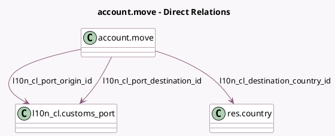

<!-- GENERATED:MODEL -->
---
tags: [odoo, enterprise, generated, model]
---

# account.move

- Module: [[docs/Enterprise Addons/l10n_cl_edi_exports/l10n_cl_edi_exports|l10n_cl_edi_exports]]
- Scope: Enterprise Addons
- Defined in module: extension only
- Source files: `models/account_move.py`
- Python classes: `AccountMove`

## Field footprint

- Detected fields: 7
- Field types: `Integer` x 1, `Many2one` x 3, `Selection` x 3
- Relation fields: 3

## Sample fields

- `l10n_cl_customs_quantity_of_packages`: `Integer`
- `l10n_cl_customs_sale_mode`: `Selection`
- `l10n_cl_customs_service_indicator`: `Selection`
- `l10n_cl_customs_transport_type`: `Selection`
- `l10n_cl_destination_country_id`: `Many2one` (comodel `res.country`, related `partner_shipping_id.country_id`)
- `l10n_cl_port_destination_id`: `Many2one` (comodel `l10n_cl.customs_port`)
- `l10n_cl_port_origin_id`: `Many2one` (comodel `l10n_cl.customs_port`)

## Method hints

- Detected methods: 3
- Action methods: none
- Compute methods: none
- Onchange methods: none

## Direct relation diagram

## Navigation

- **Parent:** [[docs/Enterprise Addons/l10n_cl_edi_exports/Models]]

<!-- GENERATED:MODEL -->
