<!-- GENERATED:MODEL -->
---
tags: [odoo, enterprise, generated, model]
---

# l10n_cl.customs_port

- Module: [[docs/Enterprise Addons/l10n_cl_edi_exports/l10n_cl_edi_exports|l10n_cl_edi_exports]]
- Scope: Enterprise Addons
- Defined in module: yes
- Source files: `models/l10n_cl_customs_port.py`
- Python classes: `L10n_ClCustoms_Port`
- Description: Chilean customs ports and codes.

## Field footprint

- Detected fields: 3
- Field types: `Char` x 1, `Integer` x 1, `Many2one` x 1
- Relation fields: 1

## Sample fields

- `code`: `Integer`
- `country_id`: `Many2one` (comodel `res.country`)
- `name`: `Char`

## Method hints

- Detected methods: 1
- Action methods: none
- Compute methods: `_compute_display_name`
- Onchange methods: none

## Direct relation diagram

```plantuml
@startuml
!define ODOO_COLOR_PRIMARY #714B67
!define ODOO_COLOR_ACCENT #875A7B
!define ODOO_COLOR_BG #FAF7FA

skinparam backgroundColor ODOO_COLOR_BG
skinparam defaultTextAlignment left
skinparam ArrowColor ODOO_COLOR_ACCENT
skinparam ClassBackgroundColor white
skinparam ClassBorderColor ODOO_COLOR_PRIMARY
skinparam ComponentBackgroundColor white
skinparam ComponentBorderColor ODOO_COLOR_PRIMARY
skinparam NoteBackgroundColor #FFF8FF
skinparam NoteBorderColor ODOO_COLOR_ACCENT
skinparam SequenceLifeLineBorderColor ODOO_COLOR_ACCENT
skinparam SequenceLifeLineBackgroundColor #FFFFFF
skinparam SequenceParticipantBorderColor ODOO_COLOR_PRIMARY
skinparam SequenceParticipantBackgroundColor #FFFFFF
skinparam sequence {
  ArrowColor ODOO_COLOR_ACCENT
  ActorBorderColor ODOO_COLOR_PRIMARY
}
title l10n_cl.customs_port - Direct Relations
class "l10n_cl.customs_port" as l10n_cl_customs_port
class "res.country" as res_country
l10n_cl_customs_port --> res_country : country_id
@enduml
```

## Navigation

- **Parent:** [[docs/Enterprise Addons/l10n_cl_edi_exports/Models]]

<!-- GENERATED:MODEL -->
