<!-- GENERATED:MODEL -->
---
tags: [odoo, enterprise, generated, model]
---

# l10n_cl.aec.generator

- Module: [[docs/Enterprise Addons/l10n_cl_edi_factoring/l10n_cl_edi_factoring|l10n_cl_edi_factoring]]
- Scope: Enterprise Addons
- Defined in module: yes
- Source files: `wizard/l10n_cl_aec_gen.py`
- Python classes: `AECGenerator`
- Description: Chilean AEC Wizard Generator

## Field footprint

- Detected fields: 2
- Field types: `Date` x 1, `Many2one` x 1
- Relation fields: 1

## Sample fields

- `invoice_date_due`: `Date` (comodel `Date Due`)
- `partner_id`: `Many2one` (comodel `res.partner`)

## Method hints

- Detected methods: 3
- Action methods: none
- Compute methods: none
- Onchange methods: none

## Direct relation diagram

```plantuml
@startuml
!define ODOO_COLOR_PRIMARY #714B67
!define ODOO_COLOR_ACCENT #875A7B
!define ODOO_COLOR_BG #FAF7FA

skinparam backgroundColor ODOO_COLOR_BG
skinparam defaultTextAlignment left
skinparam ArrowColor ODOO_COLOR_ACCENT
skinparam ClassBackgroundColor white
skinparam ClassBorderColor ODOO_COLOR_PRIMARY
skinparam ComponentBackgroundColor white
skinparam ComponentBorderColor ODOO_COLOR_PRIMARY
skinparam NoteBackgroundColor #FFF8FF
skinparam NoteBorderColor ODOO_COLOR_ACCENT
skinparam SequenceLifeLineBorderColor ODOO_COLOR_ACCENT
skinparam SequenceLifeLineBackgroundColor #FFFFFF
skinparam SequenceParticipantBorderColor ODOO_COLOR_PRIMARY
skinparam SequenceParticipantBackgroundColor #FFFFFF
skinparam sequence {
  ArrowColor ODOO_COLOR_ACCENT
  ActorBorderColor ODOO_COLOR_PRIMARY
}
title l10n_cl.aec.generator - Direct Relations
class "l10n_cl.aec.generator" as l10n_cl_aec_generator
class "res.partner" as res_partner
l10n_cl_aec_generator --> res_partner : partner_id
@enduml
```

## Navigation

- **Parent:** [[docs/Enterprise Addons/l10n_cl_edi_factoring/Models]]

<!-- GENERATED:MODEL -->
