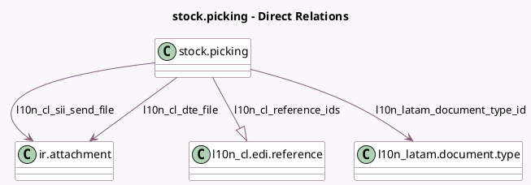

<!-- GENERATED:MODEL -->
---
tags: [odoo, enterprise, generated, model]
---

# stock.picking

- Module: [[docs/Enterprise Addons/l10n_cl_edi_stock/l10n_cl_edi_stock|l10n_cl_edi_stock]]
- Scope: Enterprise Addons
- Defined in module: yes
- Source files: `models/stock_picking.py`
- Python classes: `StockPicking`
- Inherits: `l10n_cl.edi.util`

## Field footprint

- Detected fields: 12
- Field types: `Boolean` x 2, `Char` x 2, `Many2one` x 3, `One2many` x 1, `Selection` x 3, `Text` x 1
- Relation fields: 4

## Sample fields

- `l10n_cl_delivery_guide_reason`: `Selection`
- `l10n_cl_draft_status`: `Boolean`
- `l10n_cl_dte_file`: `Many2one` (comodel `ir.attachment`)
- `l10n_cl_dte_partner_status`: `Selection`
- `l10n_cl_dte_status`: `Selection`
- `l10n_cl_is_return`: `Boolean` (compute `_compute_l10n_cl_is_return`)
- `l10n_cl_reference_ids`: `One2many` (comodel `l10n_cl.edi.reference`)
- `l10n_cl_sii_barcode`: `Char`
- `l10n_cl_sii_send_file`: `Many2one` (comodel `ir.attachment`)
- `l10n_cl_sii_send_ident`: `Text`
- `l10n_latam_document_number`: `Char`
- `l10n_latam_document_type_id`: `Many2one` (comodel `l10n_latam.document.type`)

## Method hints

- Detected methods: 30
- Action methods: `action_cancel`
- Compute methods: `_compute_l10n_cl_is_return`
- Onchange methods: none

## Direct relation diagram

## Navigation

- **Parent:** [[docs/Enterprise Addons/l10n_cl_edi_stock/Models]]

<!-- GENERATED:MODEL -->
