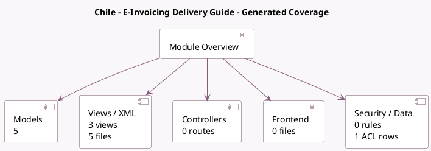

<!-- GENERATED:MODULE -->
---
tags: [odoo, enterprise, module]
---

# Chile - E-Invoicing Delivery Guide

- Scope: Enterprise Addons
- Source: enterprise/l10n_cl_edi_stock
- Dependencies: [[docs/Community Addons/sale_stock/sale_stock|sale_stock]], [[docs/Enterprise Addons/l10n_cl_edi/l10n_cl_edi|l10n_cl_edi]], [[docs/Community Addons/stock_account/stock_account|stock_account]]

## Generated coverage

- Models: 5
- XML files with UI/data artifacts: 5
- Views: 3
- Actions: 2
- Menus: 2
- Rules (ir.rule): 0
- Access CSV entries: 1
- Controller units: 0
- Frontend asset files: 0

## Module map

## Detail notes

- Models: [[docs/Enterprise Addons/l10n_cl_edi_stock/Models|Models]] (5)
- Views and XML: [[docs/Enterprise Addons/l10n_cl_edi_stock/Views|Views]] (5 files)

## Key models

- `account.move`
- `l10n_cl.edi.reference`
- `res.partner`
- `stock.move`
- `stock.picking`

## Navigation

- [[../Enterprise Addons/Enterprise Addons|Back to scope]]
- [[../../docs/docs|Back to docs]]

<!-- GENERATED:MODULE -->

