<!-- GENERATED:MODEL -->
---
tags: [odoo, enterprise, generated, model]
---

# account.move

- Module: [[docs/Enterprise Addons/l10n_co_dian/l10n_co_dian|l10n_co_dian]]
- Scope: Enterprise Addons
- Defined in module: extension only
- Source files: `models/account_move.py`
- Python classes: `AccountMove`

## Field footprint

- Detected fields: 12
- Field types: `Boolean` x 4, `Char` x 1, `Datetime` x 1, `Many2one` x 1, `One2many` x 1, `Selection` x 4
- Relation fields: 2

## Sample fields

- `l10n_co_dian_attachment_id`: `Many2one` (comodel `ir.attachment`, compute `_compute_l10n_co_dian_attachment_id`)
- `l10n_co_dian_claim_reason`: `Selection`
- `l10n_co_dian_commercial_state`: `Selection` (compute `_compute_l10n_co_dian_states`, store `True`)
- `l10n_co_dian_document_ids`: `One2many` (comodel `l10n_co_dian.document`)
- `l10n_co_dian_identifier_type`: `Selection` (compute `_compute_l10n_co_dian_identifier_type`)
- `l10n_co_dian_is_enabled`: `Boolean` (compute `_compute_l10n_co_dian_is_enabled`)
- `l10n_co_dian_post_time`: `Datetime`
- `l10n_co_dian_processed_by_get_event_status_cron`: `Boolean`
- `l10n_co_dian_show_support_doc_button`: `Boolean` (compute `_compute_l10n_co_dian_show_support_doc_button`)
- `l10n_co_dian_state`: `Selection` (compute `_compute_l10n_co_dian_states`, store `True`)
- `l10n_co_dian_update_commercial_event_enabled`: `Boolean` (compute `_compute_l10n_co_dian_update_commercial_event_enabled`)
- `l10n_co_edi_cufe_cude_ref`: `Char` (compute `_compute_l10n_co_dian_cufe`, store `True`)

## Method hints

- Detected methods: 31
- Action methods: none
- Compute methods: `_compute_l10n_co_dian_attachment_id`, `_compute_l10n_co_dian_cufe`, `_compute_l10n_co_dian_identifier_type`, `_compute_l10n_co_dian_is_enabled`, `_compute_l10n_co_dian_show_support_doc_button`, `_compute_l10n_co_dian_states`, `_compute_l10n_co_dian_update_commercial_event_enabled`, `_compute_show_reset_to_draft_button`
- Onchange methods: none

## Direct relation diagram

```plantuml
@startuml
!define ODOO_COLOR_PRIMARY #714B67
!define ODOO_COLOR_ACCENT #875A7B
!define ODOO_COLOR_BG #FAF7FA

skinparam backgroundColor ODOO_COLOR_BG
skinparam defaultTextAlignment left
skinparam ArrowColor ODOO_COLOR_ACCENT
skinparam ClassBackgroundColor white
skinparam ClassBorderColor ODOO_COLOR_PRIMARY
skinparam ComponentBackgroundColor white
skinparam ComponentBorderColor ODOO_COLOR_PRIMARY
skinparam NoteBackgroundColor #FFF8FF
skinparam NoteBorderColor ODOO_COLOR_ACCENT
skinparam SequenceLifeLineBorderColor ODOO_COLOR_ACCENT
skinparam SequenceLifeLineBackgroundColor #FFFFFF
skinparam SequenceParticipantBorderColor ODOO_COLOR_PRIMARY
skinparam SequenceParticipantBackgroundColor #FFFFFF
skinparam sequence {
  ArrowColor ODOO_COLOR_ACCENT
  ActorBorderColor ODOO_COLOR_PRIMARY
}
title account.move - Direct Relations
class "account.move" as account_move
class "ir.attachment" as ir_attachment
class "l10n_co_dian.document" as l10n_co_dian_document
account_move --|> l10n_co_dian_document : l10n_co_dian_document_ids
account_move --> ir_attachment : l10n_co_dian_attachment_id
@enduml
```

## Navigation

- **Parent:** [[docs/Enterprise Addons/l10n_co_dian/Models]]

<!-- GENERATED:MODEL -->
