<!-- GENERATED:MODEL -->
---
tags: [odoo, enterprise, generated, model]
---

# l10n_co_dian.document

- Module: [[docs/Enterprise Addons/l10n_co_dian/l10n_co_dian|l10n_co_dian]]
- Scope: Enterprise Addons
- Defined in module: yes
- Source files: `models/l10n_co_dian_document.py`
- Python classes: `L10n_Co_DianDocument`
- Description: Colombian documents used for each interaction with the DIAN

## Field footprint

- Detected fields: 13
- Field types: `Boolean` x 4, `Char` x 2, `Datetime` x 1, `Html` x 1, `Json` x 1, `Many2one` x 2, `Selection` x 2
- Relation fields: 2

## Sample fields

- `attachment_id`: `Many2one` (comodel `ir.attachment`)
- `certification_process`: `Boolean`
- `commercial_state`: `Selection`
- `datetime`: `Datetime`
- `identifier`: `Char`
- `message`: `Html` (compute `_compute_message`)
- `message_json`: `Json`
- `move_id`: `Many2one` (comodel `account.move`)
- `show_button_fetch_attached_document`: `Boolean` (compute `_compute_show_button_fetch_attached_document`)
- `show_button_get_status`: `Boolean` (compute `_compute_show_button_get_status`)
- `state`: `Selection`
- `test_environment`: `Boolean`
- `zip_key`: `Char`

## Method hints

- Detected methods: 24
- Action methods: `action_download_file`, `action_get_attached_document`, `action_get_status`
- Compute methods: `_compute_message`, `_compute_show_button_fetch_attached_document`, `_compute_show_button_get_status`
- Onchange methods: none

## Direct relation diagram

```plantuml
@startuml
!define ODOO_COLOR_PRIMARY #714B67
!define ODOO_COLOR_ACCENT #875A7B
!define ODOO_COLOR_BG #FAF7FA

skinparam backgroundColor ODOO_COLOR_BG
skinparam defaultTextAlignment left
skinparam ArrowColor ODOO_COLOR_ACCENT
skinparam ClassBackgroundColor white
skinparam ClassBorderColor ODOO_COLOR_PRIMARY
skinparam ComponentBackgroundColor white
skinparam ComponentBorderColor ODOO_COLOR_PRIMARY
skinparam NoteBackgroundColor #FFF8FF
skinparam NoteBorderColor ODOO_COLOR_ACCENT
skinparam SequenceLifeLineBorderColor ODOO_COLOR_ACCENT
skinparam SequenceLifeLineBackgroundColor #FFFFFF
skinparam SequenceParticipantBorderColor ODOO_COLOR_PRIMARY
skinparam SequenceParticipantBackgroundColor #FFFFFF
skinparam sequence {
  ArrowColor ODOO_COLOR_ACCENT
  ActorBorderColor ODOO_COLOR_PRIMARY
}
title l10n_co_dian.document - Direct Relations
class "l10n_co_dian.document" as l10n_co_dian_document
class "account.move" as account_move
class "ir.attachment" as ir_attachment
l10n_co_dian_document --> ir_attachment : attachment_id
l10n_co_dian_document --> account_move : move_id
@enduml
```

## Navigation

- **Parent:** [[docs/Enterprise Addons/l10n_co_dian/Models]]

<!-- GENERATED:MODEL -->
