<!-- GENERATED:MODEL -->
---
tags: [odoo, enterprise, generated, model]
---

# res.config.settings

- Module: [[docs/Enterprise Addons/l10n_co_dian/l10n_co_dian|l10n_co_dian]]
- Scope: Enterprise Addons
- Defined in module: extension only
- Source files: `models/res_config_settings.py`
- Python classes: `ResConfigSettings`

## Field footprint

- Detected fields: 9
- Field types: `Boolean` x 3, `Integer` x 3, `One2many` x 2, `Selection` x 1
- Relation fields: 2

## Sample fields

- `l10n_co_dian_cert_credit_count`: `Integer`
- `l10n_co_dian_cert_debit_count`: `Integer`
- `l10n_co_dian_cert_invoice_count`: `Integer`
- `l10n_co_dian_certificate_ids`: `One2many` (related `company_id.l10n_co_dian_certificate_ids`)
- `l10n_co_dian_certification_process`: `Boolean` (related `company_id.l10n_co_dian_certification_process`)
- `l10n_co_dian_demo_mode`: `Boolean` (related `company_id.l10n_co_dian_demo_mode`)
- `l10n_co_dian_operation_mode_ids`: `One2many` (related `company_id.l10n_co_dian_operation_mode_ids`)
- `l10n_co_dian_provider`: `Selection` (related `company_id.l10n_co_dian_provider`)
- `l10n_co_dian_test_environment`: `Boolean` (related `company_id.l10n_co_dian_test_environment`)

## Method hints

- Detected methods: 5
- Action methods: `action_l10n_co_certify_with_dian`
- Compute methods: none
- Onchange methods: none

## Direct relation diagram

```plantuml
@startuml
!define ODOO_COLOR_PRIMARY #714B67
!define ODOO_COLOR_ACCENT #875A7B
!define ODOO_COLOR_BG #FAF7FA

skinparam backgroundColor ODOO_COLOR_BG
skinparam defaultTextAlignment left
skinparam ArrowColor ODOO_COLOR_ACCENT
skinparam ClassBackgroundColor white
skinparam ClassBorderColor ODOO_COLOR_PRIMARY
skinparam ComponentBackgroundColor white
skinparam ComponentBorderColor ODOO_COLOR_PRIMARY
skinparam NoteBackgroundColor #FFF8FF
skinparam NoteBorderColor ODOO_COLOR_ACCENT
skinparam SequenceLifeLineBorderColor ODOO_COLOR_ACCENT
skinparam SequenceLifeLineBackgroundColor #FFFFFF
skinparam SequenceParticipantBorderColor ODOO_COLOR_PRIMARY
skinparam SequenceParticipantBackgroundColor #FFFFFF
skinparam sequence {
  ArrowColor ODOO_COLOR_ACCENT
  ActorBorderColor ODOO_COLOR_PRIMARY
}
title res.config.settings - Direct Relations
class "res.config.settings" as res_config_settings
@enduml
```

## Navigation

- **Parent:** [[docs/Enterprise Addons/l10n_co_dian/Models]]

<!-- GENERATED:MODEL -->
