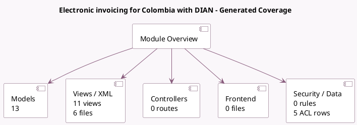

<!-- GENERATED:MODULE -->
---
tags: [odoo, enterprise, module]
---

# Electronic invoicing for Colombia with DIAN

- Scope: Enterprise Addons
- Source: enterprise/l10n_co_dian
- Dependencies: [[docs/Community Addons/account_edi_ubl_cii/account_edi_ubl_cii|account_edi_ubl_cii]], [[docs/Enterprise Addons/l10n_co_edi/l10n_co_edi|l10n_co_edi]], [[docs/Community Addons/certificate/certificate|certificate]]

## Summary

Colombian Localization for EDI documents

## Generated coverage

- Models: 13
- XML files with UI/data artifacts: 6
- Views: 11
- Actions: 2
- Menus: 0
- Rules (ir.rule): 0
- Access CSV entries: 5
- Controller units: 0
- Frontend asset files: 0

## Module map

## Detail notes

- Models: [[docs/Enterprise Addons/l10n_co_dian/Models|Models]] (13)
- Views and XML: [[docs/Enterprise Addons/l10n_co_dian/Views|Views]] (6 files)

## Key models

- `account.edi.xml.ubl_dian`
- `account.journal`
- `account.move`
- `account.move.line`
- `account.move.send`
- `certificate.certificate`
- `l10n_co_dian.claim.wizard`
- `l10n_co_dian.document`
- `l10n_co_dian.operation_mode`
- `mail.template`
- `res.company`
- `res.config.settings`

## Navigation

- [[../Enterprise Addons/Enterprise Addons|Back to scope]]
- [[../../docs/docs|Back to docs]]

<!-- GENERATED:MODULE -->

