<!-- GENERATED:MODEL -->
---
tags: [odoo, enterprise, generated, model]
---

# account.move

- Module: [[docs/Enterprise Addons/l10n_co_edi/l10n_co_edi|l10n_co_edi]]
- Scope: Enterprise Addons
- Defined in module: extension only
- Source files: `models/account_invoice.py`
- Python classes: `AccountMove`

## Field footprint

- Detected fields: 11
- Field types: `Boolean` x 3, `Char` x 3, `Many2one` x 1, `Selection` x 4
- Relation fields: 1

## Sample fields

- `l10n_co_edi_attachment_url`: `Char` (comodel `Electronic Invoice Attachment URL`)
- `l10n_co_edi_cufe_cude_ref`: `Char`
- `l10n_co_edi_debit_note`: `Boolean` (related `journal_id.l10n_co_edi_debit_note`)
- `l10n_co_edi_description_code_credit`: `Selection`
- `l10n_co_edi_description_code_debit`: `Selection`
- `l10n_co_edi_is_direct_payment`: `Boolean` (comodel `Direct Payment from Colombia`, compute `_compute_l10n_co_edi_is_direct_payment`)
- `l10n_co_edi_is_support_document`: `Boolean` (comodel `Support Document`, related `journal_id.l10n_co_edi_is_support_document`)
- `l10n_co_edi_operation_type`: `Selection` (compute `_compute_operation_type`, store `True`)
- `l10n_co_edi_payment_option_id`: `Many2one` (comodel `l10n_co_edi.payment.option`)
- `l10n_co_edi_transaction`: `Char` (comodel `Transaction ID (CO)`)
- `l10n_co_edi_type`: `Selection` (compute `_compute_l10n_co_edi_type`, store `True`)

## Method hints

- Detected methods: 7
- Action methods: none
- Compute methods: `_compute_l10n_co_edi_is_direct_payment`, `_compute_l10n_co_edi_type`, `_compute_operation_type`
- Onchange methods: none

## Direct relation diagram

```plantuml
@startuml
!define ODOO_COLOR_PRIMARY #714B67
!define ODOO_COLOR_ACCENT #875A7B
!define ODOO_COLOR_BG #FAF7FA

skinparam backgroundColor ODOO_COLOR_BG
skinparam defaultTextAlignment left
skinparam ArrowColor ODOO_COLOR_ACCENT
skinparam ClassBackgroundColor white
skinparam ClassBorderColor ODOO_COLOR_PRIMARY
skinparam ComponentBackgroundColor white
skinparam ComponentBorderColor ODOO_COLOR_PRIMARY
skinparam NoteBackgroundColor #FFF8FF
skinparam NoteBorderColor ODOO_COLOR_ACCENT
skinparam SequenceLifeLineBorderColor ODOO_COLOR_ACCENT
skinparam SequenceLifeLineBackgroundColor #FFFFFF
skinparam SequenceParticipantBorderColor ODOO_COLOR_PRIMARY
skinparam SequenceParticipantBackgroundColor #FFFFFF
skinparam sequence {
  ArrowColor ODOO_COLOR_ACCENT
  ActorBorderColor ODOO_COLOR_PRIMARY
}
title account.move - Direct Relations
class "account.move" as account_move
class "l10n_co_edi.payment.option" as l10n_co_edi_payment_option
account_move --> l10n_co_edi_payment_option : l10n_co_edi_payment_option_id
@enduml
```

## Navigation

- **Parent:** [[docs/Enterprise Addons/l10n_co_edi/Models]]

<!-- GENERATED:MODEL -->
