<!-- GENERATED:MODEL -->
---
tags: [odoo, enterprise, generated, model]
---

# res.partner

- Module: [[docs/Enterprise Addons/l10n_co_edi/l10n_co_edi|l10n_co_edi]]
- Scope: Enterprise Addons
- Defined in module: extension only
- Source files: `models/res_partner.py`
- Python classes: `ResPartner`

## Field footprint

- Detected fields: 4
- Field types: `Boolean` x 1, `Char` x 1, `Many2many` x 1, `Selection` x 1
- Relation fields: 1

## Sample fields

- `l10n_co_edi_commercial_name`: `Char` (comodel `Commercial Name`)
- `l10n_co_edi_fiscal_regimen`: `Selection`
- `l10n_co_edi_large_taxpayer`: `Boolean`
- `l10n_co_edi_obligation_type_ids`: `Many2many` (comodel `l10n_co_edi.type_code`)

## Method hints

- Detected methods: 9
- Action methods: none
- Compute methods: none
- Onchange methods: none

## Direct relation diagram

```plantuml
@startuml
!define ODOO_COLOR_PRIMARY #714B67
!define ODOO_COLOR_ACCENT #875A7B
!define ODOO_COLOR_BG #FAF7FA

skinparam backgroundColor ODOO_COLOR_BG
skinparam defaultTextAlignment left
skinparam ArrowColor ODOO_COLOR_ACCENT
skinparam ClassBackgroundColor white
skinparam ClassBorderColor ODOO_COLOR_PRIMARY
skinparam ComponentBackgroundColor white
skinparam ComponentBorderColor ODOO_COLOR_PRIMARY
skinparam NoteBackgroundColor #FFF8FF
skinparam NoteBorderColor ODOO_COLOR_ACCENT
skinparam SequenceLifeLineBorderColor ODOO_COLOR_ACCENT
skinparam SequenceLifeLineBackgroundColor #FFFFFF
skinparam SequenceParticipantBorderColor ODOO_COLOR_PRIMARY
skinparam SequenceParticipantBackgroundColor #FFFFFF
skinparam sequence {
  ArrowColor ODOO_COLOR_ACCENT
  ActorBorderColor ODOO_COLOR_PRIMARY
}
title res.partner - Direct Relations
class "res.partner" as res_partner
class "l10n_co_edi.type_code" as l10n_co_edi_type_code
res_partner .. l10n_co_edi_type_code : l10n_co_edi_obligation_type_ids
@enduml
```

## Navigation

- **Parent:** [[docs/Enterprise Addons/l10n_co_edi/Models]]

<!-- GENERATED:MODEL -->
