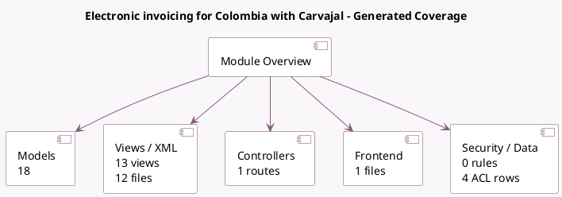

<!-- GENERATED:MODULE -->
---
tags: [odoo, enterprise, module]
---

# Electronic invoicing for Colombia with Carvajal

- Scope: Enterprise Addons
- Source: enterprise/l10n_co_edi
- Dependencies: [[docs/Community Addons/account_edi/account_edi|account_edi]], [[docs/Community Addons/l10n_co/l10n_co|l10n_co]], [[docs/Enterprise Addons/product_unspsc/product_unspsc|product_unspsc]], [[docs/Community Addons/base_address_extended/base_address_extended|base_address_extended]]

## Summary

Colombian Localization for EDI documents

## Generated coverage

- Models: 18
- XML files with UI/data artifacts: 12
- Views: 13
- Actions: 2
- Menus: 2
- Rules (ir.rule): 0
- Access CSV entries: 4
- Controller units: 1
- Frontend asset files: 1

## Module map

## Detail notes

- Models: [[docs/Enterprise Addons/l10n_co_edi/Models|Models]] (18)
- Views and XML: [[docs/Enterprise Addons/l10n_co_edi/Views|Views]] (12 files)
- Controllers: [[docs/Enterprise Addons/l10n_co_edi/Controllers|Controllers]] (1)
- Frontend: [[docs/Enterprise Addons/l10n_co_edi/Frontend|Frontend]] (1 files)

## Key models

- `account.chart.template`
- `account.debit.note`
- `account.edi.format`
- `account.journal`
- `account.move`
- `account.move.line`
- `account.move.reversal`
- `account.tax`
- `l10n_co_edi.payment.option`
- `l10n_co_edi.tax.type`
- `l10n_co_edi.type_code`
- `product.template`

## Navigation

- [[../Enterprise Addons/Enterprise Addons|Back to scope]]
- [[../../docs/docs|Back to docs]]

<!-- GENERATED:MODULE -->

