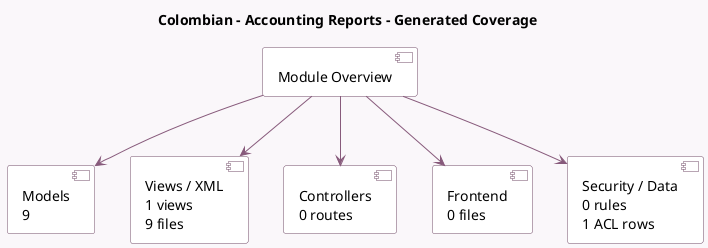

<!-- GENERATED:MODULE -->
---
tags: [odoo, enterprise, module]
---

# Colombian - Accounting Reports

- Scope: Enterprise Addons
- Source: enterprise/l10n_co_reports
- Dependencies: [[docs/Community Addons/l10n_co/l10n_co|l10n_co]], [[docs/Enterprise Addons/account_reports/account_reports|account_reports]]

## Generated coverage

- Models: 9
- XML files with UI/data artifacts: 9
- Views: 1
- Actions: 7
- Menus: 5
- Rules (ir.rule): 0
- Access CSV entries: 1
- Controller units: 0
- Frontend asset files: 0

## Module map

## Detail notes

- Models: [[docs/Enterprise Addons/l10n_co_reports/Models|Models]] (9)
- Views and XML: [[docs/Enterprise Addons/l10n_co_reports/Views|Views]] (9 files)

## Key models

- `l10n_co.account.trial.balance.per.partner.report.handler`
- `l10n_co.fuente.report.handler`
- `l10n_co.ica.report.handler`
- `l10n_co.iva.report.handler`
- `l10n_co.libro.diario.report.handler`
- `l10n_co.report.handler`
- `l10n_co_reports.retention_report.wizard`
- `report.l10n_co_reports.report_certification`
- `report.l10n_co_reports.report_libro_diario`

## Navigation

- [[../Enterprise Addons/Enterprise Addons|Back to scope]]
- [[../../docs/docs|Back to docs]]

<!-- GENERATED:MODULE -->

