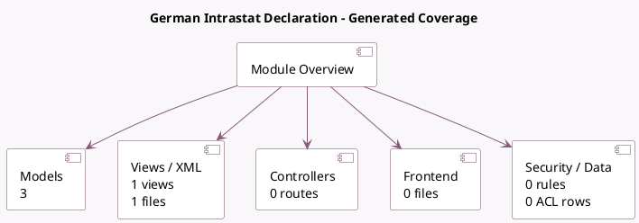

<!-- GENERATED:MODULE -->
---
tags: [odoo, enterprise, module]
---

# German Intrastat Declaration

- Scope: Enterprise Addons
- Source: enterprise/l10n_de_intrastat
- Dependencies: [[docs/Community Addons/l10n_de/l10n_de|l10n_de]], [[docs/Enterprise Addons/account_intrastat/account_intrastat|account_intrastat]]

## Generated coverage

- Models: 3
- XML files with UI/data artifacts: 1
- Views: 1
- Actions: 0
- Menus: 0
- Rules (ir.rule): 0
- Access CSV entries: 0
- Controller units: 0
- Frontend asset files: 0

## Module map

## Detail notes

- Models: [[docs/Enterprise Addons/l10n_de_intrastat/Models|Models]] (3)
- Views and XML: [[docs/Enterprise Addons/l10n_de_intrastat/Views|Views]] (1 files)

## Key models

- `account.intrastat.goods.report.handler`
- `res.company`
- `res.config.settings`

## Navigation

- [[../Enterprise Addons/Enterprise Addons|Back to scope]]
- [[../../docs/docs|Back to docs]]

<!-- GENERATED:MODULE -->

