<!-- GENERATED:MODEL -->
---
tags: [odoo, enterprise, generated, model]
---

# l10n_de_pos.dsfinvk_export

- Module: [[docs/Enterprise Addons/l10n_de_pos_cert/l10n_de_pos_cert|l10n_de_pos_cert]]
- Scope: Enterprise Addons
- Defined in module: yes
- Source files: `models/l10n_de_pos_dsfinvk_export.py`
- Python classes: `L10n_De_PosDsfinvk_Export`
- Description: This is the model that can download the data export from the DSFinV-K service in case of an audit.

## Field footprint

- Detected fields: 6
- Field types: `Char` x 1, `Datetime` x 2, `Many2one` x 2, `Selection` x 1
- Relation fields: 2

## Sample fields

- `company_id`: `Many2one` (comodel `res.company`)
- `config_id`: `Many2one` (comodel `pos.config`)
- `end_datetime`: `Datetime`
- `l10n_de_fiskaly_export_uuid`: `Char`
- `start_datetime`: `Datetime`
- `state`: `Selection`

## Method hints

- Detected methods: 6
- Action methods: none
- Compute methods: none
- Onchange methods: none

## Direct relation diagram

```plantuml
@startuml
!define ODOO_COLOR_PRIMARY #714B67
!define ODOO_COLOR_ACCENT #875A7B
!define ODOO_COLOR_BG #FAF7FA

skinparam backgroundColor ODOO_COLOR_BG
skinparam defaultTextAlignment left
skinparam ArrowColor ODOO_COLOR_ACCENT
skinparam ClassBackgroundColor white
skinparam ClassBorderColor ODOO_COLOR_PRIMARY
skinparam ComponentBackgroundColor white
skinparam ComponentBorderColor ODOO_COLOR_PRIMARY
skinparam NoteBackgroundColor #FFF8FF
skinparam NoteBorderColor ODOO_COLOR_ACCENT
skinparam SequenceLifeLineBorderColor ODOO_COLOR_ACCENT
skinparam SequenceLifeLineBackgroundColor #FFFFFF
skinparam SequenceParticipantBorderColor ODOO_COLOR_PRIMARY
skinparam SequenceParticipantBackgroundColor #FFFFFF
skinparam sequence {
  ArrowColor ODOO_COLOR_ACCENT
  ActorBorderColor ODOO_COLOR_PRIMARY
}
title l10n_de_pos.dsfinvk_export - Direct Relations
class "l10n_de_pos.dsfinvk_export" as l10n_de_pos_dsfinvk_export
class "pos.config" as pos_config
class "res.company" as res_company
l10n_de_pos_dsfinvk_export --> pos_config : config_id
l10n_de_pos_dsfinvk_export --> res_company : company_id
@enduml
```

## Navigation

- **Parent:** [[docs/Enterprise Addons/l10n_de_pos_cert/Models]]

<!-- GENERATED:MODEL -->
