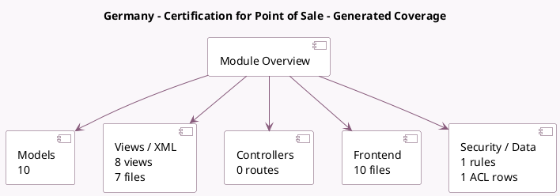

<!-- GENERATED:MODULE -->
---
tags: [odoo, enterprise, module]
---

# Germany - Certification for Point of Sale

- Scope: Enterprise Addons
- Source: enterprise/l10n_de_pos_cert
- Dependencies: [[docs/Community Addons/l10n_de/l10n_de|l10n_de]], [[docs/Community Addons/point_of_sale/point_of_sale|point_of_sale]], [[docs/Community Addons/iap/iap|iap]]

## Summary

Germany TSS Regulation

## Generated coverage

- Models: 10
- XML files with UI/data artifacts: 7
- Views: 8
- Actions: 1
- Menus: 1
- Rules (ir.rule): 1
- Access CSV entries: 1
- Controller units: 0
- Frontend asset files: 10

## Module map

## Detail notes

- Models: [[docs/Enterprise Addons/l10n_de_pos_cert/Models|Models]] (10)
- Views and XML: [[docs/Enterprise Addons/l10n_de_pos_cert/Views|Views]] (7 files)
- Frontend: [[docs/Enterprise Addons/l10n_de_pos_cert/Frontend|Frontend]] (10 files)

## Key models

- `account.tax`
- `l10n_de_pos.dsfinvk_export`
- `pos.config`
- `pos.make.payment`
- `pos.order`
- `pos.order.line`
- `pos.payment.method`
- `pos.session`
- `res.company`
- `res.config.settings`

## Navigation

- [[../Enterprise Addons/Enterprise Addons|Back to scope]]
- [[../../docs/docs|Back to docs]]

<!-- GENERATED:MODULE -->

