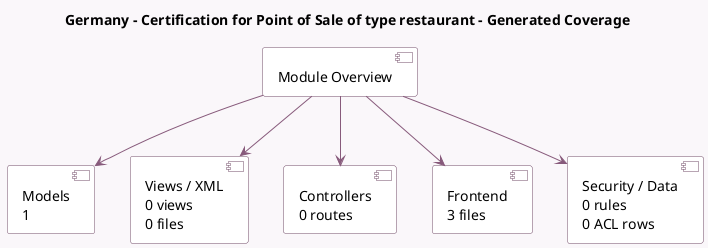

<!-- GENERATED:MODULE -->
---
tags: [odoo, enterprise, module]
---

# Germany - Certification for Point of Sale of type restaurant

- Scope: Enterprise Addons
- Source: enterprise/l10n_de_pos_res_cert
- Dependencies: [[docs/Community Addons/pos_restaurant/pos_restaurant|pos_restaurant]], [[docs/Enterprise Addons/l10n_de_pos_cert/l10n_de_pos_cert|l10n_de_pos_cert]]

## Summary

Germany TSS Regulation for restaurant

## Generated coverage

- Models: 1
- XML files with UI/data artifacts: 0
- Views: 0
- Actions: 0
- Menus: 0
- Rules (ir.rule): 0
- Access CSV entries: 0
- Controller units: 0
- Frontend asset files: 3

## Module map

## Detail notes

- Models: [[docs/Enterprise Addons/l10n_de_pos_res_cert/Models|Models]] (1)
- Frontend: [[docs/Enterprise Addons/l10n_de_pos_res_cert/Frontend|Frontend]] (3 files)

## Key models

- `pos.order`

## Navigation

- [[../Enterprise Addons/Enterprise Addons|Back to scope]]
- [[../../docs/docs|Back to docs]]

<!-- GENERATED:MODULE -->

