<!-- GENERATED:MODEL -->
---
tags: [odoo, enterprise, generated, model]
---

# l10n_dk_reports.tax.report.calendar.wizard

- Module: [[docs/Enterprise Addons/l10n_dk_reports/l10n_dk_reports|l10n_dk_reports]]
- Scope: Enterprise Addons
- Defined in module: yes
- Source files: `wizard/tax_report_wizard.py`
- Python classes: `L10nDkTaxReportRSUCalendarWizard`
- Description: L10n DK Tax Report calendar service RSU

## Field footprint

- Detected fields: 5
- Field types: `Char` x 1, `Date` x 2, `Many2one` x 2
- Relation fields: 2

## Sample fields

- `company_id`: `Many2one` (comodel `res.company`)
- `date_from`: `Date`
- `date_to`: `Date`
- `description`: `Char`
- `report_id`: `Many2one` (comodel `account.report`)

## Method hints

- Detected methods: 3
- Action methods: `action_call_company_calendar`
- Compute methods: none
- Onchange methods: none

## Direct relation diagram

```plantuml
@startuml
!define ODOO_COLOR_PRIMARY #714B67
!define ODOO_COLOR_ACCENT #875A7B
!define ODOO_COLOR_BG #FAF7FA

skinparam backgroundColor ODOO_COLOR_BG
skinparam defaultTextAlignment left
skinparam ArrowColor ODOO_COLOR_ACCENT
skinparam ClassBackgroundColor white
skinparam ClassBorderColor ODOO_COLOR_PRIMARY
skinparam ComponentBackgroundColor white
skinparam ComponentBorderColor ODOO_COLOR_PRIMARY
skinparam NoteBackgroundColor #FFF8FF
skinparam NoteBorderColor ODOO_COLOR_ACCENT
skinparam SequenceLifeLineBorderColor ODOO_COLOR_ACCENT
skinparam SequenceLifeLineBackgroundColor #FFFFFF
skinparam SequenceParticipantBorderColor ODOO_COLOR_PRIMARY
skinparam SequenceParticipantBackgroundColor #FFFFFF
skinparam sequence {
  ArrowColor ODOO_COLOR_ACCENT
  ActorBorderColor ODOO_COLOR_PRIMARY
}
title l10n_dk_reports.tax.report.calendar.wizard - Direct Relations
class "l10n_dk_reports.tax.report.calendar.wizard" as l10n_dk_reports_tax_report_calendar_wizard
class "account.report" as account_report
class "res.company" as res_company
l10n_dk_reports_tax_report_calendar_wizard --> account_report : report_id
l10n_dk_reports_tax_report_calendar_wizard --> res_company : company_id
@enduml
```

## Navigation

- **Parent:** [[docs/Enterprise Addons/l10n_dk_reports/Models]]

<!-- GENERATED:MODEL -->
