<!-- GENERATED:MODEL -->
---
tags: [odoo, enterprise, generated, model]
---

# l10n_dk_reports.tax.report.receipt.wizard

- Module: [[docs/Enterprise Addons/l10n_dk_reports/l10n_dk_reports|l10n_dk_reports]]
- Scope: Enterprise Addons
- Defined in module: yes
- Source files: `wizard/tax_report_wizard.py`
- Python classes: `L10nDkTaxReportRSUReceiptWizard`
- Description: L10n DK Tax Report receipt service RSU

## Field footprint

- Detected fields: 11
- Field types: `Binary` x 1, `Boolean` x 2, `Char` x 6, `Date` x 1, `Many2one` x 1
- Relation fields: 1

## Sample fields

- `attachment`: `Binary`
- `company_id`: `Many2one` (comodel `res.company`)
- `deadline_date`: `Date`
- `is_receipt_received`: `Boolean`
- `is_report_approved`: `Boolean`
- `link`: `Char`
- `ocr_account_number`: `Char`
- `ocr_card_type_code`: `Char`
- `ocr_identification_number`: `Char`
- `payment_ref`: `Char`
- `transaction_identifier`: `Char`

## Method hints

- Detected methods: 3
- Action methods: `action_approve_tax_report`, `action_download_pdf`, `action_receive_receipt`
- Compute methods: none
- Onchange methods: none

## Direct relation diagram

```plantuml
@startuml
!define ODOO_COLOR_PRIMARY #714B67
!define ODOO_COLOR_ACCENT #875A7B
!define ODOO_COLOR_BG #FAF7FA

skinparam backgroundColor ODOO_COLOR_BG
skinparam defaultTextAlignment left
skinparam ArrowColor ODOO_COLOR_ACCENT
skinparam ClassBackgroundColor white
skinparam ClassBorderColor ODOO_COLOR_PRIMARY
skinparam ComponentBackgroundColor white
skinparam ComponentBorderColor ODOO_COLOR_PRIMARY
skinparam NoteBackgroundColor #FFF8FF
skinparam NoteBorderColor ODOO_COLOR_ACCENT
skinparam SequenceLifeLineBorderColor ODOO_COLOR_ACCENT
skinparam SequenceLifeLineBackgroundColor #FFFFFF
skinparam SequenceParticipantBorderColor ODOO_COLOR_PRIMARY
skinparam SequenceParticipantBackgroundColor #FFFFFF
skinparam sequence {
  ArrowColor ODOO_COLOR_ACCENT
  ActorBorderColor ODOO_COLOR_PRIMARY
}
title l10n_dk_reports.tax.report.receipt.wizard - Direct Relations
class "l10n_dk_reports.tax.report.receipt.wizard" as l10n_dk_reports_tax_report_receipt_wizard
class "res.company" as res_company
l10n_dk_reports_tax_report_receipt_wizard --> res_company : company_id
@enduml
```

## Navigation

- **Parent:** [[docs/Enterprise Addons/l10n_dk_reports/Models]]

<!-- GENERATED:MODEL -->
