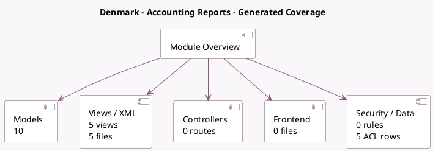

<!-- GENERATED:MODULE -->
---
tags: [odoo, enterprise, module]
---

# Denmark - Accounting Reports

- Scope: Enterprise Addons
- Source: enterprise/l10n_dk_reports
- Dependencies: [[docs/Community Addons/l10n_dk/l10n_dk|l10n_dk]], [[docs/Enterprise Addons/account_reports/account_reports|account_reports]], [[docs/Enterprise Addons/account_saft/account_saft|account_saft]], [[docs/Enterprise Addons/documents_account/documents_account|documents_account]]

## Generated coverage

- Models: 10
- XML files with UI/data artifacts: 5
- Views: 5
- Actions: 3
- Menus: 1
- Rules (ir.rule): 0
- Access CSV entries: 5
- Controller units: 0
- Frontend asset files: 0

## Module map

## Detail notes

- Models: [[docs/Enterprise Addons/l10n_dk_reports/Models|Models]] (10)
- Views and XML: [[docs/Enterprise Addons/l10n_dk_reports/Views|Views]] (5 files)

## Key models

- `account.general.ledger.report.handler`
- `account.journal`
- `account.return`
- `account.return.type`
- `l10n_dk.ec.sales.report.handler`
- `l10n_dk.tax.report.handler`
- `l10n_dk_reports.ec.sales.list.submission.wizard`
- `l10n_dk_reports.tax.report.calendar.wizard`
- `l10n_dk_reports.tax.report.receipt.wizard`
- `l10n_dk_reports.tax.report.submit.draft.wizard`

## Navigation

- [[../Enterprise Addons/Enterprise Addons|Back to scope]]
- [[../../docs/docs|Back to docs]]

<!-- GENERATED:MODULE -->

