<!-- GENERATED:MODEL -->
---
tags: [odoo, enterprise, generated, model]
---

# account.move.line

- Module: [[docs/Enterprise Addons/l10n_ec_edi/l10n_ec_edi|l10n_ec_edi]]
- Scope: Enterprise Addons
- Defined in module: extension only
- Source files: `models/account_move.py`
- Python classes: `AccountMoveLine`

## Field footprint

- Detected fields: 3
- Field types: `Many2one` x 1, `Monetary` x 1, `Selection` x 1
- Relation fields: 1

## Sample fields

- `l10n_ec_code_taxsupport`: `Selection`
- `l10n_ec_withhold_invoice_id`: `Many2one` (comodel `account.move`)
- `l10n_ec_withhold_tax_amount`: `Monetary` (compute `_compute_withhold_tax_amount`)

## Method hints

- Detected methods: 8
- Action methods: none
- Compute methods: `_compute_name`, `_compute_price_unit`, `_compute_product_uom_id`, `_compute_tax_ids`, `_compute_totals`, `_compute_withhold_tax_amount`
- Onchange methods: none

## Direct relation diagram

```plantuml
@startuml
!define ODOO_COLOR_PRIMARY #714B67
!define ODOO_COLOR_ACCENT #875A7B
!define ODOO_COLOR_BG #FAF7FA

skinparam backgroundColor ODOO_COLOR_BG
skinparam defaultTextAlignment left
skinparam ArrowColor ODOO_COLOR_ACCENT
skinparam ClassBackgroundColor white
skinparam ClassBorderColor ODOO_COLOR_PRIMARY
skinparam ComponentBackgroundColor white
skinparam ComponentBorderColor ODOO_COLOR_PRIMARY
skinparam NoteBackgroundColor #FFF8FF
skinparam NoteBorderColor ODOO_COLOR_ACCENT
skinparam SequenceLifeLineBorderColor ODOO_COLOR_ACCENT
skinparam SequenceLifeLineBackgroundColor #FFFFFF
skinparam SequenceParticipantBorderColor ODOO_COLOR_PRIMARY
skinparam SequenceParticipantBackgroundColor #FFFFFF
skinparam sequence {
  ArrowColor ODOO_COLOR_ACCENT
  ActorBorderColor ODOO_COLOR_PRIMARY
}
title account.move.line - Direct Relations
class "account.move.line" as account_move_line
class "account.move" as account_move
account_move_line --> account_move : l10n_ec_withhold_invoice_id
@enduml
```

## Navigation

- **Parent:** [[docs/Enterprise Addons/l10n_ec_edi/Models]]

<!-- GENERATED:MODEL -->
