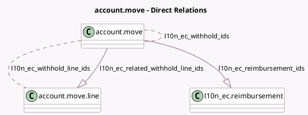

<!-- GENERATED:MODEL -->
---
tags: [odoo, enterprise, generated, model]
---

# account.move

- Module: [[docs/Enterprise Addons/l10n_ec_edi/l10n_ec_edi|l10n_ec_edi]]
- Scope: Enterprise Addons
- Defined in module: extension only
- Source files: `models/account_move.py`
- Python classes: `AccountMove`

## Field footprint

- Detected fields: 21
- Field types: `Binary` x 1, `Boolean` x 4, `Char` x 2, `Date` x 2, `Datetime` x 1, `Integer` x 2, `Json` x 1, `Many2many` x 2, `Monetary` x 1, `One2many` x 2, `Selection` x 3
- Relation fields: 4

## Sample fields

- `l10n_ec_authorization_date`: `Datetime`
- `l10n_ec_authorization_number`: `Char`
- `l10n_ec_dividend_fiscal_year`: `Char` (comodel `Dividend fiscal year`)
- `l10n_ec_dividend_income_tax`: `Monetary` (comodel `Dividend income tax`)
- `l10n_ec_dividend_payment_date`: `Date` (comodel `Dividend payment date`)
- `l10n_ec_is_dividend_withhold`: `Boolean` (compute `_compute_l10n_ec_is_dividend_withhold`)
- `l10n_ec_reimbursement_ids`: `One2many` (comodel `l10n_ec.reimbursement`)
- `l10n_ec_related_withhold_line_ids`: `One2many` (comodel `account.move.line`)
- `l10n_ec_show_add_withhold`: `Boolean` (compute `_compute_l10n_ec_show_add_withhold`)
- `l10n_ec_withhold_count`: `Integer` (compute `_compute_l10n_ec_withhold_inv_fields`)
- `l10n_ec_withhold_date`: `Date`
- `l10n_ec_withhold_foreign_regime`: `Selection`
- `l10n_ec_withhold_ids`: `Many2many` (comodel `account.move`, compute `_compute_l10n_ec_withhold_inv_fields`)
- `l10n_ec_withhold_line_ids`: `Many2many` (comodel `account.move.line`, compute `_compute_l10n_ec_withhold_wth_fields`)
- `l10n_ec_withhold_origin_invoice_count`: `Integer` (compute `_compute_l10n_ec_withhold_wth_fields`)
- `l10n_ec_withhold_subtotals`: `Json` (compute `_compute_l10n_ec_withhold_subtotals`)
- `l10n_ec_withhold_type`: `Selection` (related `journal_id.l10n_ec_withhold_type`)
- `l10n_edit_ec_authorization`: `Boolean` (compute `_compute_l10n_ec_show_edit_authorization`)
- `l10n_latam_internal_type`: `Selection` (related `l10n_latam_document_type_id.internal_type`)
- `l10n_show_ec_authorization`: `Boolean` (compute `_compute_l10n_ec_show_edit_authorization`)

## Method hints

- Detected methods: 52
- Action methods: `action_print_pdf`
- Compute methods: `_compute_access_url`, `_compute_amount`, `_compute_l10n_ec_is_dividend_withhold`, `_compute_l10n_ec_reimbursement_totals`, `_compute_l10n_ec_show_add_withhold`, `_compute_l10n_ec_show_edit_authorization`, `_compute_l10n_ec_withhold_inv_fields`, `_compute_l10n_ec_withhold_subtotals`, and 1 more
- Onchange methods: `_inverse_l10n_latam_document_number`

## Direct relation diagram

## Navigation

- **Parent:** [[docs/Enterprise Addons/l10n_ec_edi/Models]]

<!-- GENERATED:MODEL -->
