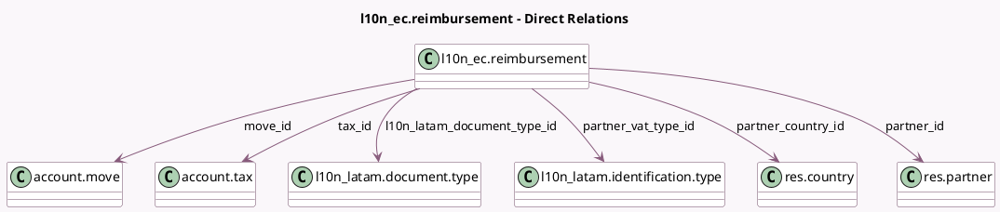

<!-- GENERATED:MODEL -->
---
tags: [odoo, enterprise, generated, model]
---

# l10n_ec.reimbursement

- Module: [[docs/Enterprise Addons/l10n_ec_edi/l10n_ec_edi|l10n_ec_edi]]
- Scope: Enterprise Addons
- Defined in module: yes
- Source files: `models/l10n_ec_reimbursement.py`
- Python classes: `L10n_EcReimbursement`
- Description: Reimbursement Lines

## Field footprint

- Detected fields: 16
- Field types: `Char` x 4, `Date` x 1, `Many2one` x 8, `Monetary` x 3
- Relation fields: 8

## Sample fields

- `authorization_number`: `Char`
- `company_id`: `Many2one` (related `move_id.company_id`)
- `currency_id`: `Many2one` (related `move_id.currency_id`)
- `date`: `Date`
- `document_number`: `Char`
- `l10n_latam_document_type_id`: `Many2one` (comodel `l10n_latam.document.type`)
- `move_id`: `Many2one` (comodel `account.move`)
- `partner_country_code`: `Char` (related `partner_country_id.code`)
- `partner_country_id`: `Many2one` (comodel `res.country`)
- `partner_id`: `Many2one` (comodel `res.partner`)
- `partner_vat_number`: `Char`
- `partner_vat_type_id`: `Many2one` (comodel `l10n_latam.identification.type`)
- `tax_amount`: `Monetary` (compute `_compute_tax_amount`, store `True`)
- `tax_base`: `Monetary`
- `tax_id`: `Many2one` (comodel `account.tax`)
- `total`: `Monetary` (compute `_compute_total`, store `True`)

## Method hints

- Detected methods: 12
- Action methods: none
- Compute methods: `_compute_tax_amount`, `_compute_total`
- Onchange methods: `onchange_authorization_number`, `onchange_l10n_ec_reimbursement_document_number`, `onchange_partner_id`

## Direct relation diagram

## Navigation

- **Parent:** [[docs/Enterprise Addons/l10n_ec_edi/Models]]

<!-- GENERATED:MODEL -->
