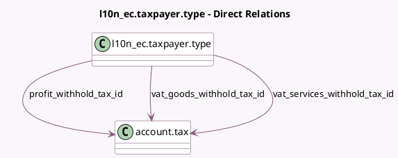

<!-- GENERATED:MODEL -->
---
tags: [odoo, enterprise, generated, model]
---

# l10n_ec.taxpayer.type

- Module: [[docs/Enterprise Addons/l10n_ec_edi/l10n_ec_edi|l10n_ec_edi]]
- Scope: Enterprise Addons
- Defined in module: yes
- Source files: `models/l10n_ec_taxpayer_type.py`
- Python classes: `L10n_EcTaxpayerType`
- Description: Taxpayer Type

## Field footprint

- Detected fields: 6
- Field types: `Boolean` x 1, `Char` x 1, `Integer` x 1, `Many2one` x 3
- Relation fields: 3

## Sample fields

- `active`: `Boolean`
- `name`: `Char`
- `profit_withhold_tax_id`: `Many2one` (comodel `account.tax`)
- `sequence`: `Integer`
- `vat_goods_withhold_tax_id`: `Many2one` (comodel `account.tax`)
- `vat_services_withhold_tax_id`: `Many2one` (comodel `account.tax`)

## Method hints

- Detected methods: 0
- Action methods: none
- Compute methods: none
- Onchange methods: none

## Direct relation diagram

## Navigation

- **Parent:** [[docs/Enterprise Addons/l10n_ec_edi/Models]]

<!-- GENERATED:MODEL -->
