<!-- GENERATED:MODEL -->
---
tags: [odoo, enterprise, generated, model]
---

# l10n_ec.wizard.account.withhold.line

- Module: [[docs/Enterprise Addons/l10n_ec_edi/l10n_ec_edi|l10n_ec_edi]]
- Scope: Enterprise Addons
- Defined in module: yes
- Source files: `wizard/l10n_ec_wizard_account_withhold.py`
- Python classes: `L10n_EcWizardAccountWithholdLine`
- Description: Withhold Wizard Lines

## Field footprint

- Detected fields: 9
- Field types: `Integer` x 1, `Many2one` x 5, `Monetary` x 2, `Selection` x 1
- Relation fields: 5

## Sample fields

- `amount`: `Monetary` (compute `_compute_amount`, store `True`)
- `base`: `Monetary` (compute `_compute_base`, store `True`)
- `company_id`: `Many2one` (related `wizard_id.company_id`)
- `currency_id`: `Many2one` (related `company_id.currency_id`)
- `invoice_id`: `Many2one` (comodel `account.move`, compute `_compute_invoice_id`, store `True`)
- `sequence`: `Integer`
- `tax_id`: `Many2one` (comodel `account.tax`)
- `taxsupport_code`: `Selection` (compute `_compute_taxsupport`, store `True`)
- `wizard_id`: `Many2one` (comodel `l10n_ec.wizard.account.withhold`)

## Method hints

- Detected methods: 7
- Action methods: none
- Compute methods: `_compute_amount`, `_compute_base`, `_compute_invoice_id`, `_compute_taxsupport`
- Onchange methods: none

## Direct relation diagram

```plantuml
@startuml
!define ODOO_COLOR_PRIMARY #714B67
!define ODOO_COLOR_ACCENT #875A7B
!define ODOO_COLOR_BG #FAF7FA

skinparam backgroundColor ODOO_COLOR_BG
skinparam defaultTextAlignment left
skinparam ArrowColor ODOO_COLOR_ACCENT
skinparam ClassBackgroundColor white
skinparam ClassBorderColor ODOO_COLOR_PRIMARY
skinparam ComponentBackgroundColor white
skinparam ComponentBorderColor ODOO_COLOR_PRIMARY
skinparam NoteBackgroundColor #FFF8FF
skinparam NoteBorderColor ODOO_COLOR_ACCENT
skinparam SequenceLifeLineBorderColor ODOO_COLOR_ACCENT
skinparam SequenceLifeLineBackgroundColor #FFFFFF
skinparam SequenceParticipantBorderColor ODOO_COLOR_PRIMARY
skinparam SequenceParticipantBackgroundColor #FFFFFF
skinparam sequence {
  ArrowColor ODOO_COLOR_ACCENT
  ActorBorderColor ODOO_COLOR_PRIMARY
}
title l10n_ec.wizard.account.withhold.line - Direct Relations
class "l10n_ec.wizard.account.withhold.line" as l10n_ec_wizard_account_withhold_line
class "account.move" as account_move
class "account.tax" as account_tax
class "l10n_ec.wizard.account.withhold" as l10n_ec_wizard_account_withhold
l10n_ec_wizard_account_withhold_line --> account_move : invoice_id
l10n_ec_wizard_account_withhold_line --> account_tax : tax_id
l10n_ec_wizard_account_withhold_line --> l10n_ec_wizard_account_withhold : wizard_id
@enduml
```

## Navigation

- **Parent:** [[docs/Enterprise Addons/l10n_ec_edi/Models]]

<!-- GENERATED:MODEL -->
