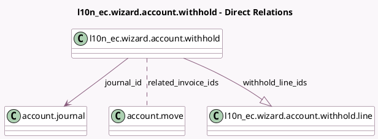

<!-- GENERATED:MODEL -->
---
tags: [odoo, enterprise, generated, model]
---

# l10n_ec.wizard.account.withhold

- Module: [[docs/Enterprise Addons/l10n_ec_edi/l10n_ec_edi|l10n_ec_edi]]
- Scope: Enterprise Addons
- Defined in module: yes
- Source files: `wizard/l10n_ec_wizard_account_withhold.py`
- Python classes: `L10n_EcWizardAccountWithhold`
- Description: Withhold Wizard

## Field footprint

- Detected fields: 18
- Field types: `Boolean` x 2, `Char` x 2, `Date` x 2, `Integer` x 1, `Json` x 1, `Many2many` x 1, `Many2one` x 4, `Monetary` x 1, `One2many` x 1, `Selection` x 3
- Relation fields: 6

## Sample fields

- `company_id`: `Many2one` (related `related_invoice_ids.company_id`, store `True`)
- `currency_id`: `Many2one` (related `company_id.currency_id`)
- `date`: `Date`
- `dividend_fiscal_year`: `Selection`
- `dividend_income_tax`: `Monetary` (comodel `Dividend income tax`)
- `dividend_payment_date`: `Date` (comodel `Dividend payment date`)
- `document_number`: `Char`
- `foreign_regime`: `Selection`
- `is_dividend_withhold`: `Boolean` (compute `_compute_is_dividend_withhold`)
- `journal_id`: `Many2one` (comodel `account.journal`, compute `_compute_journal`, store `True`)
- `manual_document_number`: `Boolean` (compute `_compute_manual_document_number`)
- `partner_country_code`: `Char` (related `related_invoice_ids.commercial_partner_id.country_id.code`)
- `partner_id`: `Many2one` (related `related_invoice_ids.partner_id`)
- `related_invoice_ids`: `Many2many` (comodel `account.move`)
- `related_invoices_count`: `Integer` (compute `_compute_related_invoices_fields`)
- `withhold_line_ids`: `One2many` (comodel `l10n_ec.wizard.account.withhold.line`, compute `_compute_withhold_lines`, store `True`)
- `withhold_subtotals`: `Json` (compute `_compute_withhold_subtotals`)
- `withhold_type`: `Selection` (compute `_compute_related_invoices_fields`)

## Method hints

- Detected methods: 19
- Action methods: `action_create_and_post_withhold`
- Compute methods: `_compute_is_dividend_withhold`, `_compute_journal`, `_compute_manual_document_number`, `_compute_related_invoices_fields`, `_compute_withhold_lines`, `_compute_withhold_subtotals`
- Onchange methods: `_onchange_dividend_payment_date`, `_onchange_document_number`

## Direct relation diagram

## Navigation

- **Parent:** [[docs/Enterprise Addons/l10n_ec_edi/Models]]

<!-- GENERATED:MODEL -->
