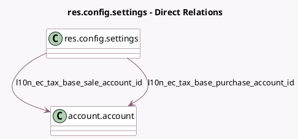

<!-- GENERATED:MODEL -->
---
tags: [odoo, enterprise, generated, model]
---

# res.config.settings

- Module: [[docs/Enterprise Addons/l10n_ec_edi/l10n_ec_edi|l10n_ec_edi]]
- Scope: Enterprise Addons
- Defined in module: extension only
- Source files: `models/res_config_settings.py`
- Python classes: `ResConfigSettings`

## Field footprint

- Detected fields: 12
- Field types: `Boolean` x 2, `Char` x 3, `Many2one` x 6, `Selection` x 1
- Relation fields: 6

## Sample fields

- `l10n_ec_edi_certificate_id`: `Many2one` (related `company_id.l10n_ec_edi_certificate_id`)
- `l10n_ec_forced_accounting`: `Boolean` (related `company_id.l10n_ec_forced_accounting`)
- `l10n_ec_legal_name`: `Char` (related `company_id.l10n_ec_legal_name`)
- `l10n_ec_production_env`: `Boolean` (related `company_id.l10n_ec_production_env`)
- `l10n_ec_regime`: `Selection` (related `company_id.l10n_ec_regime`)
- `l10n_ec_special_taxpayer_number`: `Char` (related `company_id.l10n_ec_special_taxpayer_number`)
- `l10n_ec_tax_base_purchase_account_id`: `Many2one` (comodel `account.account`, related `company_id.l10n_ec_tax_base_purchase_account_id`)
- `l10n_ec_tax_base_sale_account_id`: `Many2one` (comodel `account.account`, related `company_id.l10n_ec_tax_base_sale_account_id`)
- `l10n_ec_withhold_agent_number`: `Char` (related `company_id.l10n_ec_withhold_agent_number`)
- `l10n_ec_withhold_credit_card_tax_id`: `Many2one` (related `company_id.l10n_ec_withhold_credit_card_tax_id`)
- `l10n_ec_withhold_goods_tax_id`: `Many2one` (related `company_id.l10n_ec_withhold_goods_tax_id`)
- `l10n_ec_withhold_services_tax_id`: `Many2one` (related `company_id.l10n_ec_withhold_services_tax_id`)

## Method hints

- Detected methods: 0
- Action methods: none
- Compute methods: none
- Onchange methods: none

## Direct relation diagram

## Navigation

- **Parent:** [[docs/Enterprise Addons/l10n_ec_edi/Models]]

<!-- GENERATED:MODEL -->
