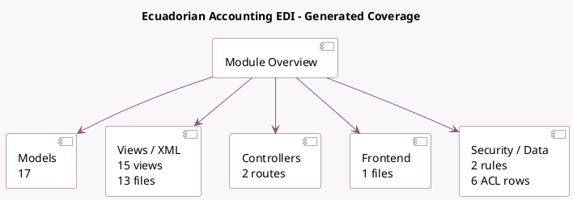

<!-- GENERATED:MODULE -->
---
tags: [odoo, enterprise, module]
---

# Ecuadorian Accounting EDI

- Scope: Enterprise Addons
- Source: enterprise/l10n_ec_edi
- Dependencies: [[docs/Community Addons/account_edi/account_edi|account_edi]], [[docs/Community Addons/certificate/certificate|certificate]], [[docs/Community Addons/l10n_ec/l10n_ec|l10n_ec]]

## Generated coverage

- Models: 17
- XML files with UI/data artifacts: 13
- Views: 15
- Actions: 3
- Menus: 2
- Rules (ir.rule): 2
- Access CSV entries: 6
- Controller units: 1
- Frontend asset files: 1

## Module map

## Detail notes

- Models: [[docs/Enterprise Addons/l10n_ec_edi/Models|Models]] (17)
- Views and XML: [[docs/Enterprise Addons/l10n_ec_edi/Views|Views]] (13 files)
- Controllers: [[docs/Enterprise Addons/l10n_ec_edi/Controllers|Controllers]] (1)
- Frontend: [[docs/Enterprise Addons/l10n_ec_edi/Frontend|Frontend]] (1 files)

## Key models

- `account.chart.template`
- `account.edi.format`
- `account.journal`
- `account.move`
- `account.move.line`
- `account.move.send`
- `account.tax`
- `certificate.certificate`
- `l10n_ec.reimbursement`
- `l10n_ec.taxpayer.type`
- `l10n_ec.wizard.account.withhold`
- `l10n_ec.wizard.account.withhold.line`

## Navigation

- [[../Enterprise Addons/Enterprise Addons|Back to scope]]
- [[../../docs/docs|Back to docs]]

<!-- GENERATED:MODULE -->

