<!-- GENERATED:MODEL -->
---
tags: [odoo, enterprise, generated, model]
---

# stock.picking

- Module: [[docs/Enterprise Addons/l10n_ec_edi_stock/l10n_ec_edi_stock|l10n_ec_edi_stock]]
- Scope: Enterprise Addons
- Defined in module: extension only
- Source files: `models/stock_picking.py`
- Python classes: `StockPicking`

## Field footprint

- Detected fields: 13
- Field types: `Binary` x 1, `Boolean` x 2, `Char` x 4, `Date` x 2, `Datetime` x 1, `Html` x 1, `Many2one` x 1, `Selection` x 1
- Relation fields: 1

## Sample fields

- `l10n_ec_allow_send_edi`: `Boolean` (compute `_compute_l10n_ec_allow_send_edi`)
- `l10n_ec_authorization_date`: `Datetime`
- `l10n_ec_authorization_number`: `Char`
- `l10n_ec_delivery_end_date`: `Date` (compute `_compute_l10n_ec_delivery_guide_dates`, store `True`)
- `l10n_ec_delivery_guide_error`: `Html`
- `l10n_ec_delivery_start_date`: `Date` (compute `_compute_l10n_ec_delivery_guide_dates`, store `True`)
- `l10n_ec_edi_content`: `Binary`
- `l10n_ec_edi_document_number`: `Char`
- `l10n_ec_edi_status`: `Selection`
- `l10n_ec_is_delivery_guide`: `Boolean` (compute `_compute_l10n_ec_is_delivery_guide`)
- `l10n_ec_plate_number`: `Char`
- `l10n_ec_transfer_reason`: `Char` (compute `_compute_l10n_ec_transfer_reason`, store `True`)
- `l10n_ec_transporter_id`: `Many2one` (comodel `res.partner`)

## Method hints

- Detected methods: 19
- Action methods: none
- Compute methods: `_compute_l10n_ec_allow_send_edi`, `_compute_l10n_ec_delivery_guide_dates`, `_compute_l10n_ec_is_delivery_guide`, `_compute_l10n_ec_transfer_reason`
- Onchange methods: none

## Direct relation diagram

```plantuml
@startuml
!define ODOO_COLOR_PRIMARY #714B67
!define ODOO_COLOR_ACCENT #875A7B
!define ODOO_COLOR_BG #FAF7FA

skinparam backgroundColor ODOO_COLOR_BG
skinparam defaultTextAlignment left
skinparam ArrowColor ODOO_COLOR_ACCENT
skinparam ClassBackgroundColor white
skinparam ClassBorderColor ODOO_COLOR_PRIMARY
skinparam ComponentBackgroundColor white
skinparam ComponentBorderColor ODOO_COLOR_PRIMARY
skinparam NoteBackgroundColor #FFF8FF
skinparam NoteBorderColor ODOO_COLOR_ACCENT
skinparam SequenceLifeLineBorderColor ODOO_COLOR_ACCENT
skinparam SequenceLifeLineBackgroundColor #FFFFFF
skinparam SequenceParticipantBorderColor ODOO_COLOR_PRIMARY
skinparam SequenceParticipantBackgroundColor #FFFFFF
skinparam sequence {
  ArrowColor ODOO_COLOR_ACCENT
  ActorBorderColor ODOO_COLOR_PRIMARY
}
title stock.picking - Direct Relations
class "stock.picking" as stock_picking
class "res.partner" as res_partner
stock_picking --> res_partner : l10n_ec_transporter_id
@enduml
```

## Navigation

- **Parent:** [[docs/Enterprise Addons/l10n_ec_edi_stock/Models]]

<!-- GENERATED:MODEL -->
