<!-- GENERATED:MODEL -->
---
tags: [odoo, enterprise, generated, model]
---

# stock.warehouse

- Module: [[docs/Enterprise Addons/l10n_ec_edi_stock/l10n_ec_edi_stock|l10n_ec_edi_stock]]
- Scope: Enterprise Addons
- Defined in module: extension only
- Source files: `models/stock_warehouse.py`
- Python classes: `StockWarehouse`

## Field footprint

- Detected fields: 5
- Field types: `Char` x 3, `Integer` x 1, `Many2one` x 1
- Relation fields: 1

## Sample fields

- `l10n_ec_country_code`: `Char` (related `company_id.country_code`)
- `l10n_ec_delivery_number`: `Integer` (related `l10n_ec_delivery_number_sequence_id.number_next`)
- `l10n_ec_delivery_number_sequence_id`: `Many2one` (comodel `ir.sequence`)
- `l10n_ec_emission`: `Char`
- `l10n_ec_entity`: `Char`

## Method hints

- Detected methods: 3
- Action methods: none
- Compute methods: none
- Onchange methods: none

## Direct relation diagram

```plantuml
@startuml
!define ODOO_COLOR_PRIMARY #714B67
!define ODOO_COLOR_ACCENT #875A7B
!define ODOO_COLOR_BG #FAF7FA

skinparam backgroundColor ODOO_COLOR_BG
skinparam defaultTextAlignment left
skinparam ArrowColor ODOO_COLOR_ACCENT
skinparam ClassBackgroundColor white
skinparam ClassBorderColor ODOO_COLOR_PRIMARY
skinparam ComponentBackgroundColor white
skinparam ComponentBorderColor ODOO_COLOR_PRIMARY
skinparam NoteBackgroundColor #FFF8FF
skinparam NoteBorderColor ODOO_COLOR_ACCENT
skinparam SequenceLifeLineBorderColor ODOO_COLOR_ACCENT
skinparam SequenceLifeLineBackgroundColor #FFFFFF
skinparam SequenceParticipantBorderColor ODOO_COLOR_PRIMARY
skinparam SequenceParticipantBackgroundColor #FFFFFF
skinparam sequence {
  ArrowColor ODOO_COLOR_ACCENT
  ActorBorderColor ODOO_COLOR_PRIMARY
}
title stock.warehouse - Direct Relations
class "stock.warehouse" as stock_warehouse
class "ir.sequence" as ir_sequence
stock_warehouse --> ir_sequence : l10n_ec_delivery_number_sequence_id
@enduml
```

## Navigation

- **Parent:** [[docs/Enterprise Addons/l10n_ec_edi_stock/Models]]

<!-- GENERATED:MODEL -->
