<!-- GENERATED:MODEL -->
---
tags: [odoo, enterprise, generated, model]
---

# res.company

- Module: [[docs/Enterprise Addons/l10n_employment_hero/l10n_employment_hero|l10n_employment_hero]]
- Scope: Enterprise Addons
- Defined in module: extension only
- Source files: `models/res_company.py`
- Python classes: `ResCompany`

## Field footprint

- Detected fields: 6
- Field types: `Boolean` x 1, `Char` x 3, `Date` x 1, `Many2one` x 1
- Relation fields: 1

## Sample fields

- `employment_hero_api_key`: `Char`
- `employment_hero_base_url`: `Char`
- `employment_hero_enable`: `Boolean`
- `employment_hero_identifier`: `Char`
- `employment_hero_journal_id`: `Many2one` (comodel `account.journal`)
- `employment_hero_lock_date`: `Date`

## Method hints

- Detected methods: 6
- Action methods: none
- Compute methods: none
- Onchange methods: none

## Direct relation diagram

```plantuml
@startuml
!define ODOO_COLOR_PRIMARY #714B67
!define ODOO_COLOR_ACCENT #875A7B
!define ODOO_COLOR_BG #FAF7FA

skinparam backgroundColor ODOO_COLOR_BG
skinparam defaultTextAlignment left
skinparam ArrowColor ODOO_COLOR_ACCENT
skinparam ClassBackgroundColor white
skinparam ClassBorderColor ODOO_COLOR_PRIMARY
skinparam ComponentBackgroundColor white
skinparam ComponentBorderColor ODOO_COLOR_PRIMARY
skinparam NoteBackgroundColor #FFF8FF
skinparam NoteBorderColor ODOO_COLOR_ACCENT
skinparam SequenceLifeLineBorderColor ODOO_COLOR_ACCENT
skinparam SequenceLifeLineBackgroundColor #FFFFFF
skinparam SequenceParticipantBorderColor ODOO_COLOR_PRIMARY
skinparam SequenceParticipantBackgroundColor #FFFFFF
skinparam sequence {
  ArrowColor ODOO_COLOR_ACCENT
  ActorBorderColor ODOO_COLOR_PRIMARY
}
title res.company - Direct Relations
class "res.company" as res_company
class "account.journal" as account_journal
res_company --> account_journal : employment_hero_journal_id
@enduml
```

## Navigation

- **Parent:** [[docs/Enterprise Addons/l10n_employment_hero/Models]]

<!-- GENERATED:MODEL -->
