<!-- GENERATED:MODEL -->
---
tags: [odoo, enterprise, generated, model]
---

# l10n_es_reports.aeat.boe.mod347.export.wizard

- Module: [[docs/Enterprise Addons/l10n_es_real_estates/l10n_es_real_estates|l10n_es_real_estates]]
- Scope: Enterprise Addons
- Defined in module: extension only
- Source files: `wizard/aeat_boe_export_wizards.py`
- Python classes: `L10n_Es_ReportsAeatBoeMod347ExportWizard`

## Field footprint

- Detected fields: 1
- Field types: `One2many` x 1
- Relation fields: 1

## Sample fields

- `real_estates_vat_mod347_data`: `One2many` (comodel `l10n_es_reports.aeat.mod347.real.estates.vat`)

## Method hints

- Detected methods: 1
- Action methods: none
- Compute methods: none
- Onchange methods: none

## Direct relation diagram

```plantuml
@startuml
!define ODOO_COLOR_PRIMARY #714B67
!define ODOO_COLOR_ACCENT #875A7B
!define ODOO_COLOR_BG #FAF7FA

skinparam backgroundColor ODOO_COLOR_BG
skinparam defaultTextAlignment left
skinparam ArrowColor ODOO_COLOR_ACCENT
skinparam ClassBackgroundColor white
skinparam ClassBorderColor ODOO_COLOR_PRIMARY
skinparam ComponentBackgroundColor white
skinparam ComponentBorderColor ODOO_COLOR_PRIMARY
skinparam NoteBackgroundColor #FFF8FF
skinparam NoteBorderColor ODOO_COLOR_ACCENT
skinparam SequenceLifeLineBorderColor ODOO_COLOR_ACCENT
skinparam SequenceLifeLineBackgroundColor #FFFFFF
skinparam SequenceParticipantBorderColor ODOO_COLOR_PRIMARY
skinparam SequenceParticipantBackgroundColor #FFFFFF
skinparam sequence {
  ArrowColor ODOO_COLOR_ACCENT
  ActorBorderColor ODOO_COLOR_PRIMARY
}
title l10n_es_reports.aeat.boe.mod347.export.wizard - Direct Relations
class "l10n_es_reports.aeat.boe.mod347.export.wizard" as l10n_es_reports_aeat_boe_mod347_export_wizard
class "l10n_es_reports.aeat.mod347.real.estates.vat" as l10n_es_reports_aeat_mod347_real_estates_vat
l10n_es_reports_aeat_boe_mod347_export_wizard --|> l10n_es_reports_aeat_mod347_real_estates_vat : real_estates_vat_mod347_data
@enduml
```

## Navigation

- **Parent:** [[docs/Enterprise Addons/l10n_es_real_estates/Models]]

<!-- GENERATED:MODEL -->
